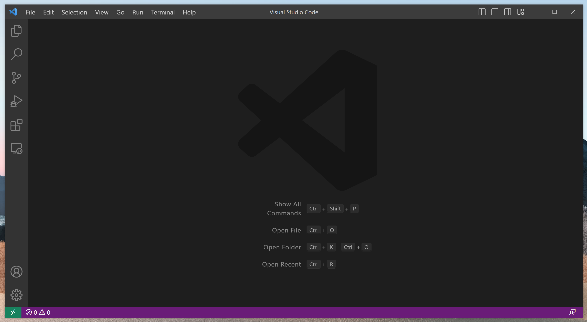
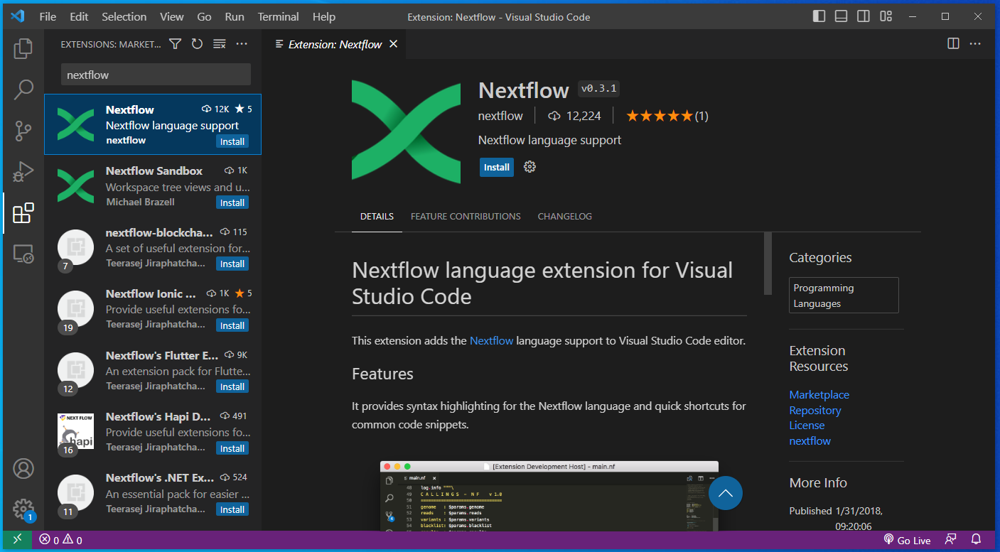

[//]: <> (PREAMBLE)

# Janis Translate Examples

This repository documents examples of using Janis to translate Galaxy &amp; CWL workflows to Nextflow.

This markdown provides a brief [background](#background) to workflow migration, [setup instructions](#setup) for the required software, and [links to the individual tutorials](#tutorials).

[//]: <> (/PREAMBLE)

For the Australian BioCommons Janis translate workshop (19th of June 2023) materials, please see [Janis Translate Workshop 19/06/2023](janis_translate.md)

<br>

## Background

**Bioinformatics workflows** are critical for reproducibly transferring methodologies between research groups and for scaling between computational infrastructures. Research groups currently invest a lot of time and effort in creating and updating workflows; the ability to translate from one workflow language into another can make them easier to share, and maintain with minimal effort. For example, research groups that would like to run an existing Galaxy workflow on HPC, or extend it for their use, might find translating the workflow to Nextflow more suitable for their ongoing use-cases. 

**Janis** is a framework that provides an abstraction layer for describing workflows, and a tool that can translate workflows between existing languages such as CWL, WDL, Galaxy and Nextflow. Janis aims to translate as much as it can, leaving the user to validate the workflow and make small manual adjustments where direct translations are not possible. Originating from the Portable Pipelines Project between Melbourne Bioinformatics, the Peter MacCallum Cancer Centre, and the Walter and Eliza Hall Institute of Medical Research, this tool is now available for everyone to use.

<br>

## Setup

**Software**

[//]: <> (SOFTWARE_INSTALLATION)

Make sure you have the following installed:
- [Nextflow](https://nf-co.re/usage/installation)
- [Singularity](https://docs.sylabs.io/guides/3.0/user-guide/installation.html) or [Docker](https://docs.docker.com/engine/install/)
- [Janis](https://janis.readthedocs.io/en/latest/index.html)

[//]: <> (/SOFTWARE_INSTALLATION)

<br>

**IDE**

Any IDE or a CLI text editor (VIM, nano) are sufficient for this material. 

We recommend Visual Studio Code (VS Code) as it is lightweight and has rich support for extensions to add functionality. <br>
Download Visual Studio Code for your system from [here](https://code.visualstudio.com/download) and follow the instructions for:
- [macOS](https://code.visualstudio.com/docs/setup/mac)
- [Linux](https://code.visualstudio.com/docs/setup/linux)
- [Windows](https://code.visualstudio.com/docs/setup/windows)

Once installed, open VS Code. 



VS Code can be customised using extensions. <br>

The Nextflow extension provides syntax highlighting and quick shortcuts for common code snippets.<br>
Click on the extensions button (four blocks) on the left side bar.<br>
Search for "Nextflow" in the extensions search bar, then click on the "Install" next to the Nextflow extension.



[//]: <> (REMOTE_SSH_EXTENSION)

[//]: <> (/REMOTE_SSH_EXTENSION)

<br>

**Source files & Sample data**

The source tool / workflow files, as well as sample data can be downlaoded from the following link: [ZENODO LINK].

Once downloaded, uncompress the archive using the following command: 
```
tar -xvf janis_translate_examples.tar.gz
```

Then change directory to the downloaded folder:
```
cd janis_translate_examples 
```


<br>

## Tutorials

**CWL to Nextflow**
- [Samtools Flagstat Tool](tutorials/cwl/tools/samtools_flagstat/tutorial.md)
- [GATK HaplotypeCaller Tool](tutorials/cwl/tools/gatk_haplotype_caller/tutorial.md)
- [Align Sort Markdup Workflow](tutorials/cwl/workflows/align_sort_markdup/tutorial.md)

**Galaxy to Nextflow**
- [Samtools Flagstat Tool](tutorials/galaxy/tools/samtools_flagstat/tutorial.md)
- [Limma Voom Tool](tutorials/galaxy/tools/limma_voom/tutorial.md)
- [RNA-Seq reads to counts workflow](tutorials/galaxy/workflows/rnaseq_reads_to_counts/tutorial.md)
