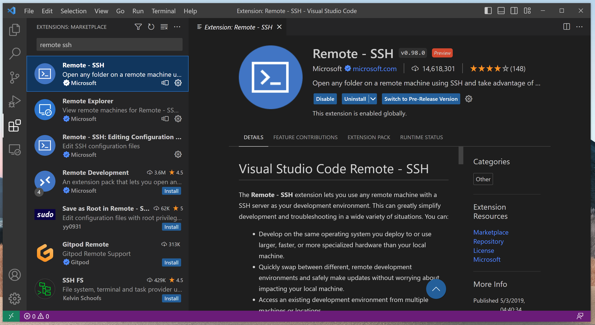

[//]: <> (PREAMBLE)

# Janis Translate Examples

This repository documents examples of using Janis to translate Galaxy &amp; CWL workflows to Nextflow.

This markdown provides a brief [background](#background) to workflow migration, [setup instructions](#setup) for the required software, and [links to the individual tutorials](#tutorials).

[//]: <> (/PREAMBLE)

 

## Background

**Workflows**

**CWL**

**Galaxy**

**Nextflow**

**Janis**

 

## Setup

**Software**

[//]: <> (SOFTWARE_INSTALLATION)

During the workshop we will be using compute provided by the [NCI Nirin cloud computing platform](https://nci.org.au/our-systems/cloud-systems).  
Nirin cloud is a high-availability, high-capacity compute service as part of NCI's multi-Petabyte national research data collections.

All CLI software (Nextflow, Singularity, Janis) will be set up on the compute resource. 

[//]: <> (/SOFTWARE_INSTALLATION)

**IDE**

Visual Studio Code (VS Code) is a popular IDE and will be used in the workshop.

Download Visual Studio Code for your system from [here](https://code.visualstudio.com/download) and follow the instructions for:
- [macOS](https://code.visualstudio.com/docs/setup/mac)
- [Linux](https://code.visualstudio.com/docs/setup/linux)
- [Windows](https://code.visualstudio.com/docs/setup/windows)

Once installed, open VS Code. 

VS Code can be customised using extensions.  

The Nextflow extension provides syntax highlighting and quick shortcuts for common code snippets.

Click on the extensions button (four blocks) on the left side bar.
Search for "Nextflow" in the extensions search bar, then click on the "Install" next to the Nextflow extension.

[//]: <> (REMOTE_SSH_EXTENSION)

Remote-SSH allows us to use any remote machine with a SSH server as your development environment. This lets us use the machine provided by Nirin cloud as if it was our local machine.

Search for "Remote - SSH" in the extensions search bar and install it. 

[//]: <> (/REMOTE_SSH_EXTENSION)

 

## Tutorials

**CWL to Nextflow**
- [Samtools Flagstat Tool](tutorials/cwl/tools/samtools_flagstat/tutorial.md)
- [GATK HaplotypeCaller Tool](tutorials/cwl/tools/gatk_haplotype_caller/tutorial.md)
- [Align Sort Markdup Workflow](tutorials/cwl/workflows/align_sort_markdup/tutorial.md)

**Galaxy to Nextflow**
- [Samtools Flagstat Tool](tutorials/galaxy/tools/samtools_flagstat/tutorial.md)
- [Limma Voom Tool](tutorials/galaxy/tools/limma_voom/tutorial.md)
- [RNA-Seq reads to counts workflow](tutorials/galaxy/workflows/rnaseq_reads_to_counts/tutorial.md)