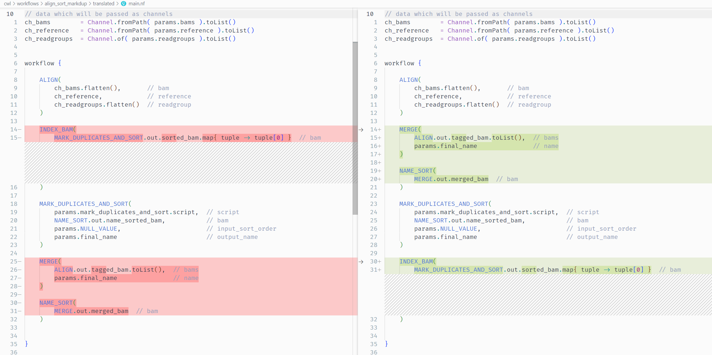
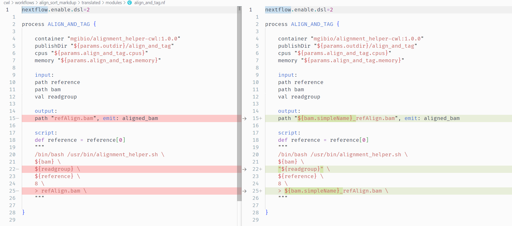

# Align Sort Markdup Workflow Translation

## Introduction

This tutorial demonstrates translation of a CWL workflow to Nextflow using `janis translate`. 

<br>


**Source Workflow**

The workflow used in this tutorial is taken from the [McDonnell Genome Institute](https://www.genome.wustl.edu/) (MGI) [analysis-workflows](https://github.com/genome/analysis-workflows) repository. <br>
This resource stores publically available analysis pipelines for genomics data. <br>
It is a fantastic piece of research software, and the authors thank MGI for their contribution to open-source research software. 

The workflow using in this tutorial - [align_sort_markdup](https://github.com/genome/analysis-workflows/blob/master/definitions/subworkflows/align_sort_markdup.cwl) - accepts multiple unaligned readsets as input and produces a single polished alignment bam file. 

*Main Inputs* 
- Unaligned reads stored across multiple BAM files
- Reference genome index

*Main Outputs*
- Single BAM file storing alignment for all readsets

*Steps*
- Read alignment (run in parallel across all readsets) - `bwa mem`
- Merging alignment BAM files to single file - `samtools merge`
- Sorting merged BAM by coordinate - `sambamba sort`
- Tagging duplicate reads in alignment - `picard MarkDuplicates` 
- Indexing final BAM - `samtools index`

<br>

**Tutorial Outcomes**

In this tutorial we will:
- Install the required software
- Translate the CWL using `janis translate`
- Make manual adjustments to the translation if necessary
- Run the nextflow using sample input data to validate our nextflow code

After completing this short tutorial, you will be familiar with using `janis translate` to migrate workflow tools in CWL to Nextflow.

Other tutorials exist to demonstrate migration from WDL / CWL / Galaxy -> Nextflow in this repository, including full workflow migrations with multiple tasks. 

<br>

**Installation**

To begin, make sure you have [nextflow](https://nf-co.re/usage/installation), [docker](https://docs.docker.com/engine/install/), and [janis translate](https://janis.readthedocs.io/en/latest/index.html) installed. <br>
The links above contain installation instructions. 

<br>

## Janis Translate

To translate a workflow,  we use `janis translate`.

```
janis translate --from <src> --to <dest> <filepath>
```

The `--from` specifies the workflow language of the source file(s), and `--to` specifies the destination we want to translate to. 

<br>

**Run Janis Translate**

In our case, we want to translate CWL -> Nextflow, and our source CWL file is located at `source/subworkflows/align_sort_markdup.cwl` relative to this document.

*using pip*

To translate `align_sort_markdup.cwl` to nextflow, we can write the following in a shell:
```
janis translate --from cwl --to nextflow ./source/subworkflows/align_sort_markdup.cwl
```

*using docker (linux bash)*

If the janis translate docker container is being used, we can write the following:
```
docker run -v $(pwd):/home janis translate --from cwl --to nextflow ./source/subworkflows/align_sort_markdup.cwl
```

<br>

**Translation Output**

The output translation will contain multiple files and directories.<br>
You will see a folder called `translated` appear - inside this folder, we should see the following structure:

```
├── main.nf                             # main workflow (align_sort_markdup)
├── modules                             # folder containing nextflow processes
│   ├── align_and_tag.nf
│   ├── index_bam.nf
│   ├── mark_duplicates_and_sort.nf
│   ├── merge_bams_samtools.nf
│   └── name_sort.nf
├── nextflow.config                     # config file to supply input information
├── subworkflows                        # folder containing nextflow subworkflows
│   └── align.nf    
└── templates                           # folder containing any scripts used by processes
    └── markduplicates_helper.sh
```

Now we have performed translation using `janis translate`, we need to check the translated workflow for correctness.  

From here, we will do a test-run of the workflow using sample data, and make manual adjustments to the translated workflow where needed. 

<br>

## Running the Translated Workflow


**Inspect main.nf**

The main workflow translation appears as `main.nf` in the `translated/` folder. <br>

This filename is just a convention, and we use it to provide clarity about the main entry point of the workflow. <br>
In our case `main.nf` holds the nextflow definition for the  `align_sort_markdup.cwl` workflow. 

> NOTE: <br>
> Before continuing, feel free to have a look at the other nextflow files which have been generated during translation:<br>
> Each CWL subworkflow appears as a nextflow `workflow` in the `subworkflows/` directory.<br>
> Each CWL tool appears as a nextflow `process` in the `modules/` directory. 

In `main.nf` we see the nextflow workflows / processes called by the main workflow:

```
include { ALIGN } from './subworkflows/align'
include { INDEX_BAM } from './modules/index_bam'
include { MARK_DUPLICATES_AND_SORT } from './modules/mark_duplicates_and_sort'
include { MERGE_BAMS_SAMTOOLS as MERGE } from './modules/merge_bams_samtools'
include { NAME_SORT } from './modules/name_sort'
```

We also see that some nextflow `Channels` have been set up. <br>
These are used to supply data according to nextflow's adoption of the *dataflow* programming model.
```
// data which will be passed as channels
ch_bams        = Channel.fromPath( params.bams ).toList()
ch_reference   = Channel.fromPath( params.reference ).toList()
ch_readgroups  = Channel.of( params.readgroups ).toList()
```

Focusing on the channel declarations, we want to note a few things:

- `ch_bams` is analygous to the *'bams'* input in `align_sort_markdup.cwl`. <br>
It declares a queue channel which expects the data supplied via `params.bams` are `path` types. <br>
It then groups the bams together as a sole emission. <br>
We will need to set up `params.bams` to supply this data.

- `ch_reference` is analygous to the *'reference'* input in `align_sort_markdup.cwl`. <br>
This channel collects the *'reference'* primary & secondary files as a sole emission. <br> 
We will need to set up `params.reference` to supply this data. 

- `ch_readgroups` is analygous to the *'readgroups'* input in `align_sort_markdup.cwl`. <br>
It is the same as `ch_bams`, except it requires `val` types rather than `path` types. <br>
We will need to set up `params.readgroups` to supply this data.


> Note: `.toList()` <br><br>
> Nextflow queue channels work differently to lists. <br>
> Instead of supplying all items together, queue channels emit each item separately. <br> 
> This results in a separate task being spawned for each item in the queue when the channel is used. <br>
> As the CWL workflow input specifies that `bams` is a list, we use `.toList()` to group all items as a sole emission. <br>
> This mimics a CWL array which is the datatype of the `bams` inputs. <br><br>
> As it turns out, the CWL workflow ends up running the `align` step in parallel across the `bams` & `readgroups` inputs. <br><br>
> Parallelisation in nextflow happens by default. <br>
> To facilitate this, the `.flatten()` method is called on  `ch_bams` and `ch_readgroups` when used in the `ALIGN` task. <br>
> This emits items in `ch_bams` and `ch_readgroups` individually, spawning a new `ALIGN` task for each pair. <br><br>
> We're kinda doing redundant work by calling `.toList()`, then `.flatten()` when `ch_bams` and `ch_readgroups` are used.<br>
> `janis translate` isn't smart enough yet to detect this yet, but may do so in future. 

<br>

The main `workflow {}` has 5 tasks. <br>
Each task has been supplied values according to the source workflow. <br>
Comments display the name of the process/workflow input which is being fed a particular value. 

```
workflow {

    ALIGN(
        ch_bams.flatten(),       // bam
        ch_reference,            // reference
        ch_readgroups.flatten()  // readgroup
    )

    INDEX_BAM(
        MARK_DUPLICATES_AND_SORT.out.sorted_bam.map{ tuple -> tuple[0] }  // bam
    )

    MARK_DUPLICATES_AND_SORT(
        params.mark_duplicates_and_sort.script,  // script
        NAME_SORT.out.name_sorted_bam,           // bam
        params.NULL_VALUE,                       // input_sort_order
        params.final_name                        // output_name
    )

    MERGE(
        ALIGN.out.tagged_bam.toList(),  // bams
        params.final_name               // name
    )

    NAME_SORT(
        MERGE.out.merged_bam  // bam
    )

}
```

<br>

Before `main.nf` can be run, we will need to supply values for the `params` variables. 
This is done in `nextflow.config`. 

<br>

**Inspect nextflow.config**

To test the translated workflow, we will first set up workflow inputs in `nextflow.config`. 

Before running a workflow, nextflow will attempt to open `nextflow.config` and read in config information and global *param* variables from this file. 
We use this file to tell nextflow how to run and to supply workflow inputs.

Inside the `translated/` folder you will see that `nextflow.config` is already provided. 

Janis translate creates this file to provide clarity about the necessary workflow inputs, and to set some other config variables. 

Open `nextflow.config` and have a look at the contents. It should look similar to the following: 

```
nextflow.enable.dsl=2
docker.enabled = true

params {
    
    // Placeholder for null values.
    // Do not alter unless you know what you are doing.
    NULL_VALUE = 'NULL'

    // WORKFLOW OUTPUT DIRECTORY
    outdir  = './outputs'

    // INPUTS (MANDATORY)
    bams        = []          // (MANDATORY array)             eg. [file1, ...]
    reference   = []          // (MANDATORY fastawithindexes)  eg. [fasta, amb, ann, bwt, dict, fai, pac, sa]
    readgroups  = NULL_VALUE  // (MANDATORY array)             eg. [string1, ...]

    // INPUTS (OPTIONAL)
    final_name  = "final.bam" 

    // PROCESS: ALIGN_AND_TAG
    align_and_tag.cpus    = 8     
    align_and_tag.memory  = 20000 

    // PROCESS: INDEX_BAM
    index_bam.memory  = 4000 

    // PROCESS: MARK_DUPLICATES_AND_SORT
    mark_duplicates_and_sort.script  = "(local_dir)/templates/markduplicates_helper.sh"
    mark_duplicates_and_sort.cpus    = 8
    mark_duplicates_and_sort.memory  = 40000

    // PROCESS: MERGE_BAMS_SAMTOOLS
    merge_bams_samtools.cpus    = 4    
    merge_bams_samtools.memory  = 8000 

    // PROCESS: NAME_SORT
    name_sort.cpus    = 8     
    name_sort.memory  = 26000 

}
```

> NOTE: `NULL_VALUE = 'NULL'`<br><br>
> Nextflow doesn't like `null` values to be passed to process inputs. <br>
> This is a challenge for translation as other languages allow `optional` inputs. <br>
> To get around this, Janis Translate sets the `params.NULL_VALUE` variable as a `null` placeholder for `val` type inputs. <br>
> You will see this being used in nextflow processes to do optionality checking.

<br>

The auto-generated `nextflow.config` splits up workflow inputs using some headings. 

```
// INPUTS (MANDATORY)
```
Workflow inputs which are required to run the workflow. We must provide a value for these. 

```
// INPUTS (OPTIONAL)
```
Workflow inputs which are not required to run the workflow. These are optional. 

```
// PROCESS: ALIGN_AND_TAG
```
Inputs which are specific to a particular process. <br>
These are usually static values rather than files.  <br> 
May be *mandatory* or *optional*. 

<br>

**Setting up Workflow Inputs**

Janis Translate will enter values for workflow inputs where possible. <br>
Others need to be manually supplied as they are specific to the input data you wish to use. 

In our case, we need to supply values for those under the `// INPUTS (MANDATORY)` heading. 
Specifically, we need to provide sample data for the `bams`, `reference`, and `readgroups` inputs. 

Copy and paste the following text, supplying values for these inputs in your current `nextflow.config` file:

```
    // INPUTS (MANDATORY)
    bams        = [
        "../../../../sample_data/cwl/2895499223.bam",
        "../../../../sample_data/cwl/2895499237.bam",
    ]
    reference   = [
        "../../../../sample_data/cwl/chr17_test.fa",
        "../../../../sample_data/cwl/chr17_test.fa.amb",
        "../../../../sample_data/cwl/chr17_test.fa.ann",
        "../../../../sample_data/cwl/chr17_test.fa.bwt",
        "../../../../sample_data/cwl/chr17_test.fa.fai",
        "../../../../sample_data/cwl/chr17_test.dict",
        "../../../../sample_data/cwl/chr17_test.fa.pac",
        "../../../../sample_data/cwl/chr17_test.fa.sa",
    ] 
    readgroups  = [
        '"@RG\tID:2895499223\tPU:H7HY2CCXX.3.ATCACGGT\tSM:H_NJ-HCC1395-HCC1395\tLB:H_NJ-HCC1395-HCC1395-lg24-lib1\tPL:Illumina\tCN:WUGSC"',
        '"@RG\tID:2895499237\tPU:H7HY2CCXX.4.ATCACGGT\tSM:H_NJ-HCC1395-HCC1395\tLB:H_NJ-HCC1395-HCC1395-lg24-lib1\tPL:Illumina\tCN:WUGSC"'
    ]
```

<br>


**Run the Workflow**

Ensure you are in the `translated/` working directory, where `nextflow.config` and `main.nf` reside. 

If not, use the following to change directory. 
```
cd translated/
```

To run the workflow using our sample data, we can now write the following command: 
```
nextflow run main.nf
```

While the workflow runs, you will encounter this error:

```
Access to 'MARK_DUPLICATES_AND_SORT.out' is undefined since the process 'MARK_DUPLICATES_AND_SORT' has not been invoked before accessing the output attribute
```

This is somewhat expected. Janis translate doesn't produce perfect translations - just the best it can do. <br>
This is the first of ***3*** errors we will encounter and fix while making this workflow runnable. 


<br>

## Manual Adjustments

Translations performed by `janis translate` often require manual changes due to the difficulty of translating between languages with non-overlapping feature sets. 

In this section we will fix ***3 errors*** to bring the translation to a finished state. 

> NOTE <br>
> If having trouble during this section, the finished workflow is available in the `./final` folder for reference.

<br>

### Error 1: Task Order

The first issue we need to address is caused by tasks being in the wrong order. 

**Error message:**
```
Access to 'MARK_DUPLICATES_AND_SORT.out' is undefined since the process 'MARK_DUPLICATES_AND_SORT' has not been invoked before accessing the output attribute
```

This nextflow error message is quite informative, and tells us that a task is trying to access the output of `MARK_DUPLICATES_AND_SORT` before it has run. 

The offending task is `INDEX_BAM` as it uses `MARK_DUPLICATES_AND_SORT.out.sorted_bam.map{ tuple -> tuple[0] }` as an input value to the process. 

You may notice here that other tasks are also using input values before they are available. 

In the source CWL `align_sort_markdup.cwl` workflow we can see the correct order:

```
steps:
    align:
        ...
    merge:
        ...
    name_sort:
        ...
    mark_duplicates_and_sort:
        ...
    index_bam:
        ...

```

Yet this differs from our translated `main.nf` which has the following order:

```
workflow {

    ALIGN(
        ...
    )

    INDEX_BAM(
        ...
    )

    MARK_DUPLICATES_AND_SORT(
        ...
    )

    MERGE(
        ...
    )

    NAME_SORT(
        ...
    )

}
```

<br>

**Solution**

Rearrange the task calls in `main.nf` so they mirror the order in the source CWL. 

Cut and paste the task calls so that they are in the following order:
- ALIGN
- MERGE
- NAME_SORT
- MARK_DUPLICATES_AND_SORT
- INDEX_BAM

After you are done, rerun the workflow by using the same command as before.

```
nextflow run main.nf
```

<br>

### Error 2: Unquoted Strings

The second error is due to the `readgroup` input of the `ALIGN_AND_TAG` process being used without enclosing quotes. 

**Error message**
```
Caused by:
Process `ALIGN:ALIGN_AND_TAG (1)` terminated with an error exit status (1)

Command executed:
/bin/bash /usr/bin/alignment_helper.sh     2895499223.bam     @RG INCLID:2895499223RY_PU:H7HY2CCXX.3.ATCACGGTITY=ISM:H_NJ-HCC1395-HCC1395ILB:H_NJ-HCC1395-HCC1395-lg24-lib1LEVEL=5PL:IlluminaSCN:WUGSC     chr17_test.fa          8     > refAlign.bam
```

The issue can be seen in the command above. 

We see `/bin/bash /usr/bin/alignment_helper.sh   2895499223.bam` which is expected. <br>
This is then followed by what looks like 2 string arguments: `@RG` and `INCLID...`.<br>
This is causing the problem.

<br>

The `Command executed` section in nextflow error messages is particularly useful. <br> 
This message is printed to the shell, but can also be seen by navigating to the process working directory & viewing `.command.sh`. 

Let's look at the nextflow `ALIGN_AND_TAG` process so we can match up which process input is causing the error. <br>
Indiviual arguments have been marked with their (position) to aid our investigation. 

```
process ALIGN_AND_TAG {
    
    container "mgibio/alignment_helper-cwl:1.0.0"
    publishDir "${params.outdir}/align_and_tag"
    cpus "${params.align_and_tag.cpus}"
    memory "${params.align_and_tag.memory}"

    input:
    path reference
    path bam
    val readgroup

    output:
    path "refAlign.bam", emit: aligned_bam

    script:
    def reference = reference[0]
    """
    (1) /bin/bash (2) /usr/bin/alignment_helper.sh \
    (3) ${bam} \
    (4) ${readgroup} \
    (5) ${reference} \
    (6) 8 \
    (7) > (8) refAlign.bam \
    """

}
```

Here is the command executed with the same numbering:

```
(1) /bin/bash (2) /usr/bin/alignment_helper.sh  (3) 2895499223.bam     (4) @RG (5) INCLID:2895499223RY_PU:H7HY2CCXX.3.ATCACGGTITY=ISM:H_NJ-HCC1395-HCC1395ILB:H_NJ-HCC1395-HCC1395-lg24-lib1LEVEL=5PL:IlluminaSCN:WUGSC   (6) chr17_test.fa        (7) 8  (8) >  (9) refAlign.bam 
```

Matching up the two, we can see that arugments `(1-3)` match their expected values. <br>
Argument `(4)` starts out right, as we expect the `readgroup` input. 

Looking in the `script:` section of the nextflow process, we expect the `${reference}` input to appear as argument `(5)`, but in the actual command it appears as argument `(6)` `chr17_test.fa`.

The issue seems to be that the `readgroup` input has been split into 2 strings, instead of 1 single string. <br>
By tracing back through the workflow, we can track that `params.readgroups` supplies the value for `readgroup` in this nextflow process:

```
modules/align_and_tag.nf:  readgroup
subworkflows/align.nf:     ch_readgroup
main.nf:                   ch_readgroups.flatten()
main.nf:                   ch_readgroups  = Channel.of( params.readgroups ).toList()
```

Looking at `nextflow.config` we see that this particular readgroup value is supplied as follows:

```
@RG\tID:2895499223\tPU:H7HY2CCXX.3.ATCACGGT\tSM:H_NJ-HCC1395-HCC1395\tLB:H_NJ-HCC1395-HCC1395-lg24-lib1\tPL:Illumina\tCN:WUGSC
```

The `@RG` being split from the rest of the readgroup value, and the text which follows is incorrect in the command.  

The issue here is that this value in `params.readgroups` contains spaces and tabs (`\t`). <br>
When used in a nextflow process, string arugments should be enclosed  using `""`. 

<br>

**Solution**

Back in the `modules/align_and_tag.nf` file, let's properly enclose the `readgroup` input in quotes. 

In the `ALIGN_AND_TAG` process script, make the following change: 

```
    script:
    def reference = reference[0]
    """
    /bin/bash /usr/bin/alignment_helper.sh \
    ${bam} \
    "${readgroup}" \              <- quotes added
    ${reference} \
    8 \
    > refAlign.bam \
    """
```

After you are have made the change, re-run the workflow by using the same command as before:

```
nextflow run main.nf
```

<br>

### Error 3: Filename Clashes

The final error is flagged by the nextflow workflow engine. 

<br>

**Error Message**

Upon re-running the workflow, you will encounter the following message:
```
Process `MERGE` input file name collision -- There are multiple input files for each of the following file names: refAlign.bam
```

This informs us that more than 1 file with the name `refAlign.bam` have been inputs to `MERGE` process. 

Nextflow does not allow this behaviour. <br>

Other workflow engines use temporary names for files so that name clashes are impossible. <br> 
Nextflow requires us to be more specific with our filenames so we can track which file is which. 

This is not a hard-and-fast rule of workflow engines, but nextflow enforces using unique names to encourage best-practises. 

To track the cause, let's look at the data which feeds the `MERGE` process. 

`main.nf`
```
MERGE(
    ALIGN.out.tagged_bam.toList(),  // bams
    params.final_name               // name
)
```

We can see the translated nextflow workflow is collecting the `tagged_bam` output of all `ALIGN` tasks as a list using `.toList()`. <br>
This value feeds the `bams` input of the `MERGE` process. 

The issue is that 2+ files in this list must have the same filename: "refAlign.bam".<br>
We need to see how files end up being placed into `ALIGN.out.tagged_bam` to track where the error is occuring. 

Looking in the `ALIGN` subworkflow in `subworkflows/align.nf`, we see the offending `tagged_bam` output emit. <br>
This gets its data from the `aligned_bam` output of the `ALIGN_AND_TAG` process in `modules/align_and_tag.nf`. 

The source of the issue must be that the `aligned_bam` output is producing the same filename each time the task is run. 

Opening `modules/align_and_tag.nf` we can see how the `align_bam` output is created & collected:
```
    output:
    path "refAlign.bam", emit: aligned_bam          <-

    script:
    def reference = reference[0]
    """
    /bin/bash /usr/bin/alignment_helper.sh \
    ${bam} \
    "${readgroup}" \
    ${reference} \
    8 \
    > refAlign.bam \                                <-
    """
```

From looking at the `output` and `script` section of this process, we can see that `aligned_bam` will always have the same name. 

In the script, we create a file called `refAlign.bam` by redirecting `stdout` to this file. <br>
In the output, `refAlign.bam` is collected as the output. 

This would be fine if our workflow was supplied only a single BAM input file, but we want our workflow to run when we have many BAMs. 

<br>

**Solution**

To fix this issue, we need to give the output files unique names. 

As our input BAM files will all have unique names, we can use this as a base and append `_refAlign.bam` onto the end.  

To access the filename of a `path` input without directory and extension, we can use `.simpleName`. <br>
For example if we have the following path: `sample_data/alignment.bam`, calling `.simpleName` would yield `alignment`. <br>
The directory path and the extension have been trimmed out. 

In the `ALIGN_AND_TAG` process in `modules/align_and_tag.nf`, make the following changes:

```
process ALIGN_AND_TAG {
    
    container "mgibio/alignment_helper-cwl:1.0.0"
    publishDir "${params.outdir}/align_and_tag"
    cpus "${params.align_and_tag.cpus}"
    memory "${params.align_and_tag.memory}"

    input:
    path reference
    path bam
    val readgroup

    output:
    path "${bam.simpleName}_refAlign.bam", emit: aligned_bam    <-

    script:
    def reference = reference[0]
    """
    /bin/bash /usr/bin/alignment_helper.sh \
    ${bam} \
    "${readgroup}" \
    ${reference} \
    8 \
    > ${bam.simpleName}_refAlign.bam \                          <-
    """

}
```

This will cause an input BAM with the filename `sample1.bam` to be redirected to `sample1_refAlign.bam`, which will be collected by the `aligned_bam` output. 

Notice the use of `.simpleName` to access the file's base name. 

<br>

After you are have made these changes, re-run the workflow by using the same command as before:
```
nextflow run main.nf
```

With any luck, this will fix the remaining issues and the workflow will now run to completion. 

<br>

## Completed Workflow


Once completed, we can check the `./outputs` folder to view our results. <br>
If everything went well, the `./outputs` folder should have the following structure:
```
outputs
├── align_and_tag
│   ├── 2895499223_refAlign.bam
│   └── 2895499237_refAlign.bam
├── index_bam
│   ├── final.bam
│   └── final.bam.bai
├── mark_duplicates_and_sort
│   ├── final.bam
│   ├── final.bam.bai
│   └── final.mark_dups_metrics.txt
├── merge_bams_samtools
│   └── final.bam.merged.bam
└── name_sort
    └── final.NameSorted.bam
```


If having trouble, the finished workflow is also available in the `./final` folder for reference.

In addition, the following diffs shows the changes we made to files during manual adjustment of the workflow. 

`main.nf`



`align_and_tag.nf`




<br>

### Conclusion

In this tutorial we explored how to translate the `align_sort_markdup` CWL workflow to Nextflow using `janis translate`. 

For your interest, the following tutorials are also available:
- Tutorials for single CWL tool translations are available in the `cwl/tools` folder. 
- Tutorials for Galaxy -> Nextflow tools and workflows are available in the `galaxy` folder at the top level of this repository. 

<br>

Thank you for your time! 

We hope `janis translate` can assist you in your work. 

If you have any bugs or issues you need help with, please raise an issue in the [janis-core github repository](https://github.com/PMCC-BioinformaticsCore/janis-core). <br>
We look at each issue raised and aim to resolve these if possible. 


