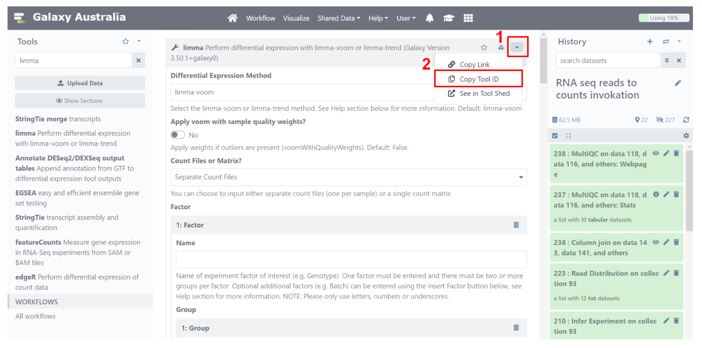
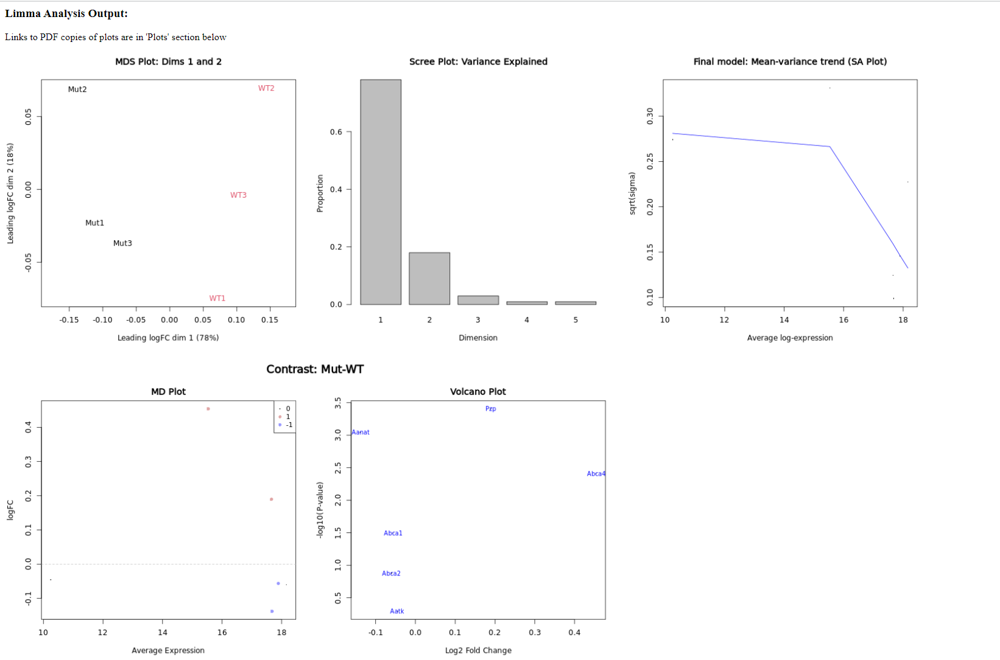
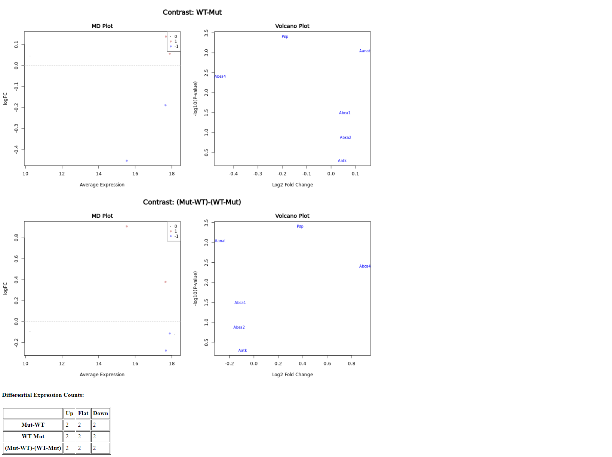
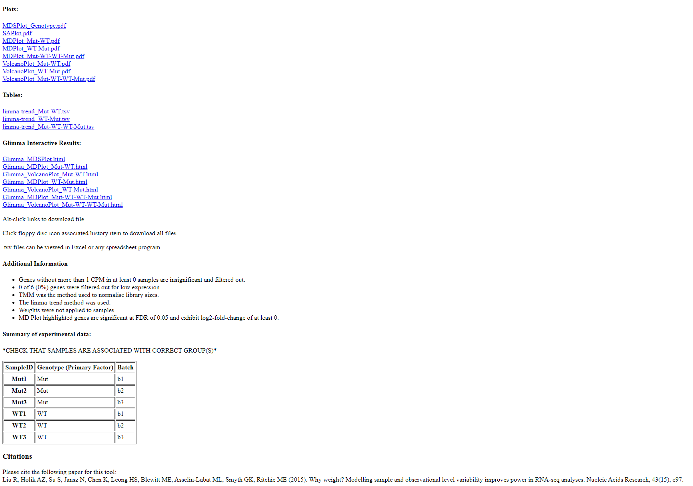
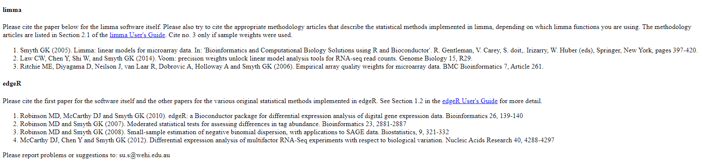

# Limma-Voom Tool Translation

<br>

## Introduction

This tutorial demonstrates translation of the `limma` tool from Galaxy to Nextflow using `janis translate`.  

This tutorial aims to document a ***more challenging*** translation, as this Galaxy Tool Wrapper is complex and uses and Rscript to run its analysis. 

***Shian Su*** is the original author of the `limma` Galaxy tool wrapper we are translating today. <br>
***Maria Doyle*** has also contributed multiple times over its many years of use as maintainence and upgrades. 

The Limma package has had many contributors over the years, including but not limited to:
- Gordon K. Smyth
- Matthew Ritchie
- Natalie Thorne
- James Wettenhall
- Wei Shi
- Yifang Hu

See the following articles related to Limma:

- Limma package capabilities (new and old)<br>
*Ritchie, ME, Phipson, B, Wu, D, Hu, Y, Law, CW, Shi, W, and Smyth, GK (2015).
limma powers differential expression analyses for RNA-sequencing and microarray studies.
Nucleic Acids Research 43(7), e47.*

- Limma for DE analysis<br>
*Phipson, B, Lee, S, Majewski, IJ, Alexander, WS, and Smyth, GK (2016). Robust
hyperparameter estimation protects against hypervariable genes and improves power to
detect differential expression. Annals of Applied Statistics 10(2), 946–963.*

- Limma-Voom for DE analysis of RNA-Seq data<br>
*Law, CW, Chen, Y, Shi, W, and Smyth, GK (2014). Voom: precision weights unlock
linear model analysis tools for RNA-seq read counts. Genome Biology 15, R29.*

<br>

**Source Tool**

In this tutorial we will translate the Galaxy `limma` tool. <br>

Limma is an R package which analyses gene expression using microarray or RNA-Seq data. <br>
The most common use (at time of writing) is referred to as limma-voom, which performs Differential Expression (DE) analysis on RNA-Seq data between multiple samples. 

The `voom` part of `limma-voom` is functionality within `limma` which adapts limma to use RNA-Seq data instead of microarray data. <br>
Since RNA-Seq data has become more common than microarray data at time of writing, limma-voom is likely the most popular use of the `limma` package as a workflow.

Under the hood, the Galaxy `limma` tool contains an R script which configures & runs limma based on command-line inputs. <br>
This allows Galaxy users to run `limma` as a complete workflow, rather than as individual R library functions. 

<br>

**Tutorial Outcomes**

In this tutorial we will:
- Install the required software
- Translate the Galaxy tool using `janis translate`
- Make manual adjustments to the translation if necessary
- Run the nextflow using sample input data to validate our nextflow code

After completing this short tutorial, you will be familiar with using `janis translate` to migrate tools from Galaxy to Nextflow.

Other tutorials exist to demonstrate migration from WDL / CWL / Galaxy -> Nextflow in this repository, including full workflow migrations with multiple tasks. 

<br>

**Installation**

To begin, make sure you have [nextflow](https://nf-co.re/usage/installation), [docker](https://docs.docker.com/engine/install/), and [janis translate](https://janis.readthedocs.io/en/latest/index.html) installed. <br>
The links above contain installation instructions. 

<br>

## Janis Translate

To translate a workflow,  we use `janis translate`.

```
janis translate --from <src> --to <dest> <filepath>
```

The `--from` specifies the workflow language of the source file(s), and `--to` specifies the destination we want to translate to. 

In our case, we want to translate a Galaxy -> Nextflow. 

Aside from local filepaths, `janis translate` can also access Galaxy Tool Wrappers using a tool ID. <br>
We will use this method in this tutorial. 


To get the `limma` Tool ID, navigate to the tool using any usegalaxy.org server. <br>
The following is a link to the limma tool in Galaxy Australia: <br> https://usegalaxy.org.au/root?tool_id=toolshed.g2.bx.psu.edu/repos/iuc/limma_voom/limma_voom/3.50.1+galaxy0. 

Once here, we will copy the Tool ID. 



At time of writing, the current Tool ID for the `limma` tool wrapper is *toolshed.g2.bx.psu.edu/repos/iuc/limma_voom/limma_voom/3.50.1+galaxy0*

Now we have the Tool ID, we can access & translate this Galaxy Tool Wrapper to a Nextflow process. 

<br>

*using pip*

To translate the `limma` tool wrapper to nextflow, we can write the following in a shell:
```
janis translate --from cwl --to nextflow toolshed.g2.bx.psu.edu/repos/iuc/limma_voom/limma_voom/3.50.1+galaxy0
```

*using docker (linux bash)*

If the janis translate docker container is being used, we can write the following:
```
docker run -v $(pwd):/home janis translate --from cwl --to nextflow \ toolshed.g2.bx.psu.edu/repos/iuc/limma_voom/limma_voom/3.50.1+galaxy0
```

<br>

Once complete, you will see a folder called `translated` appear, and a nextflow process called `limma_voom.nf` will be present inside. 

For your own reference / interest, the actual Galaxy Tool Wrapper files will be downloaded during translation & present in `translated/source`. 

<br>


## Manual Adjustments

Inside the `/translated` folder, we see the following: 
- A Nextflow process named `limma_voom.nf`
- An Rscript named `limma_voom.R` 
- A folder named `source/` containing the Galaxy Tool Wrapper XML

**limma_voom.nf**

The `translated/limma_voom.nf` file is our nextflow process. It should be similar to the following: 

```
nextflow.enable.dsl=2

process LIMMA_VOOM {
    
    container "quay.io/biocontainers/janis-translate-limma-voom-3.34.9.9"

    input:
    path limma_voom_script
    path option_a
    path option_c
    path option_f
    path option_m
    path option_r
    val option_o

    output:
    path "output_dir/*_filtcounts", emit: outFilt
    path "output_dir/*_normcounts", emit: outNorm
    path "outReport.html", emit: outReport
    path "output_dir/*.tsv?", emit: outTables
    path "libsizeinfo", emit: out_libinfo
    path "unknown_collection_pattern", emit: out_rscript

    script:
    """
    Rscript \
    ${limma_voom_script} \
    -C ${option_c} \
    -R ${option_r} \
    -a ${option_a} \
    -f ${option_f} \
    -m ${option_m} \
    -G 10 \
    -c 1 \
    -d "BH" \
    -j "" \
    -l 0 \
    -n "TMM" \
    -o ${option_o} \
    -p 0.05 \
    -s 0 \
    -t 3 \
    -z 0 \
    "i" \
    """

}

```

That this nextflow process has multiple inputs, many command line arguments, and multiple outputs. 

We can also see that a container image is available for this tool. In the next section we will run this process using some sample data and the specified container. 

Look at the command line arguments for this process in the `script:` section.

This Galaxy Tool Wrapper is evidently running an Rscript which we supply to the process as `limma_voom_script`, then the arguments for that Rscript follow after. 

When translating Galaxy Tool Wrappers, we often see this usage of scripts. <br>
`limma` is an R library, so we need an Rscript to run the analysis we want. <br>
The Galaxy Tool Wrapper supplies user inputs to this script, then the script will run the analysis. 

> NOTE<br>
> `janis translate` will copy across any scripts needed to run the Galaxy tool. <br>
> The `translated/limma_voom.R` file is the Rscript which this Galaxy tool uses to run the analysis. 

<br>

**limma_voom.R**

From reading the nextflow process, it isn't particularly obvious what each command line argument does. <br>
We know that the process input are supplied to the `limma_voom.R` script, but the names aren't very descriptive. <br>
Luckily, the author of this script has good documentation at the top of the script to help us out. 

Open `limma_voom.R`. <br>
At the top of the file, we see some documentation:

```
# This tool takes in a matrix of feature counts as well as gene annotations and
# outputs a table of top expressions as well as various plots for differential
# expression analysis
#
# ARGS: htmlPath", "R", 1, "character"      -Path to html file linking to other outputs
#       outPath", "o", 1, "character"       -Path to folder to write all output to
#       filesPath", "j", 2, "character"     -JSON list object if multiple files input
#       matrixPath", "m", 2, "character"    -Path to count matrix
#       factFile", "f", 2, "character"      -Path to factor information file
#       factInput", "i", 2, "character"     -String containing factors if manually input
#       annoPath", "a", 2, "character"      -Path to input containing gene annotations
#       contrastFile", "C", 1, "character"  -Path to contrasts information file
#       contrastInput", "D", 1, "character" -String containing contrasts of interest
#       cpmReq", "c", 2, "double"           -Float specifying cpm requirement
#       cntReq", "z", 2, "integer"          -Integer specifying minimum total count requirement
#       sampleReq", "s", 2, "integer"       -Integer specifying cpm requirement
#       normCounts", "x", 0, "logical"      -String specifying if normalised counts should be output
#       rdaOpt", "r", 0, "logical"          -String specifying if RData should be output
#       lfcReq", "l", 1, "double"           -Float specifying the log-fold-change requirement
#       pValReq", "p", 1, "double"          -Float specifying the p-value requirement
#       pAdjOpt", "d", 1, "character"       -String specifying the p-value adjustment method
#       normOpt", "n", 1, "character"       -String specifying type of normalisation used
#       robOpt", "b", 0, "logical"          -String specifying if robust options should be used
#       trend", "t", 1, "double"            -Float for prior.count if limma-trend is used instead of voom
#       weightOpt", "w", 0, "logical"       -String specifying if voomWithQualityWeights should be used
#       topgenes", "G", 1, "integer"        -Integer specifying no. of genes to highlight in volcano and heatmap
#       treatOpt", "T", 0, "logical"        -String specifying if TREAT function should be used
#       plots, "P", 1, "character"          -String specifying additional plots to be created
#
# OUT:
#       Density Plots (if filtering)
#       Box Plots (if normalising)
#       MDS Plot
#       Voom/SA plot
#       MD Plot
#       Volcano Plot
#       Heatmap
#       Expression Table
#       HTML file linking to the ouputs
# Optional:
#       Normalised counts Table
#       RData file
#
#
# Author: Shian Su - registertonysu@gmail.com - Jan 2014
# Modified by: Maria Doyle - Jun 2017, Jan 2018, May 2018
```

<br>

For each process input, find the command line argument it feeds, then look up the argument documentation in `limma_voom.R`. 

For example, the `option_a` process input feeds the `-a` argument.<br>
Looking at the documentation, we see that this is the gene annotations file. 
```
# limma_voom.nf
-a ${option_a} \

# limma_voom.R
annoPath", "a", 2, "character"      -Path to input containing gene annotations
```
The `option_c` process input feeds the `-C` argument, which is a file containing contrasts of interest:
```
# limma_voom.nf
-C ${option_c} \

# limma_voom.R
contrastFile", "C", 1, "character"  -Path to contrasts information file
```

<br>


**Modifying Inputs**

*html path*

The `path option_r` process input specifies the name of a html file which will present our results. <br>
This should be a `val` input rather than `path`. <br>
We aren't actually supplying a file; we are providing the script a filename, which should be a string.<br>
*Modify*  `path option_r` to `val option_r`. 

<br>

**Modifying Script**

From reading the documentation, you may have noticed that some arguments aren't needed, while others need adjusting. 

*multiple input files*

`-j` is only needed when we have multiple input files. <br>
We will be using a single input counts file.<br>
*Remove* this argument. 

<br>

**Modifying Outputs**

Galaxy Tool Wrappers often allow you to generate extra outputs based on what the user wants. <br>
For this tutorial, we're not interested in any of the optional outputs - just the single `outReport` output. <br>
*Remove* all the process outputs except `outReport`.


**Add publishDir Directive**

So we can view the outputs of this process when it is run, let's add a `publishDir` directive. <br>
This lets us specify a folder where outputs of this process should be presented. <br>
*Add* `publishDir "./outputs"` as a new line under the `container "quay.io/biocontainers/janis-translate-limma-voom-3.34.9.9"` directive.

<br>

Your Nextflow process should now look similar to the following: 
```
process LIMMA_VOOM {
    
    container "quay.io/biocontainers/janis-translate-limma-voom-3.34.9.9"
    publishDir "./outputs"

    input:
    path limma_voom_script
    path option_a
    path option_c
    path option_f
    path option_m
    val option_r
    val option_o

    output:
    path "outReport.html", emit: outReport

    script:
    """
    Rscript \
    ${limma_voom_script} \
    -C ${option_c} \
    -R ${option_r} \
    -a ${option_a} \
    -f ${option_f} \
    -m ${option_m} \
    -G 10 \
    -P "i" \
    -c 1 \
    -d "BH" \
    -l 0 \
    -n "TMM" \
    -o ${option_o} \
    -p 0.05 \
    -s 0 \
    -t 3 \
    -z 0 \
    """

}
```

<br>

Now that we have fixed up the process definition, we can set up `nextflow.config` and run the process with sample data to test. 


<br>


## Running Limma Voom as a Workflow

In this section we will run our translated `LIMMA_VOOM` process. 
We will set up a workflow with a single `LIMMA_VOOM` task, and will supply inputs to this task using `nextflow.config`. 

<br>

**Setting up nextflow.config**

To run this process, we will set up a `nextflow.config` file to supply inputs and other config. 

Create a new file called `nextflow.config` in the `translated/` folder alongside `limma_voom.nf`. 

Copy and paste the following code into your `nextflow.config` file. <br>
Replace `(local_dir)` with the directory path to `janis-translate-examples`.

```
docker.enabled = true

params {
    limma_voom_script = "(local_dir)/galaxy/tools/limma-voom/final/limma_voom.R"
    annotation_file   = "(local_dir)/sample_data/galaxy/limma_voom_tool/anno.txt"
    contrast_file     = "(local_dir)/sample_data/galaxy/limma_voom_tool/contrasts.txt"
    factor_file       = "(local_dir)/sample_data/galaxy/limma_voom_tool/factorinfo.txt"
    matrix_file       = "(local_dir)/sample_data/galaxy/limma_voom_tool/matrix.txt"
    html_path         = "outReport.html"
    output_path       = "."
}
```

This tells nextflow to use docker, and sets up input parameters for our sample data.

<br>

**Creating Workflow & Passing Data** 

Now we have input data set up using the `params` global variable, we will add some lines to the top of `limma_voom.nf` to turn it into a workflow.

Copy and paste the following lines at the top of `limma_voom.nf`:

```
nextflow.enable.dsl=2

workflow {
    LIMMA_VOOM(
        params.limma_voom_script,   // limma_voom_script
        params.annotation_file,     // option_a
        params.contrast_file,       // option_c
        params.factor_file,         // option_f
        params.matrix_file,         // option_m
        params.html_path,           // option_r
        params.output_path,         // option_o
    )
}
```

The new `workflow {}` section declares the main workflow entry point. <br>
When we run `limma_voom.nf`, nextflow will look for this section and run the workflow contained within. 

In our case, the workflow only contains a single task, which runs the `LIMMA_VOOM` process defined below the workflow section. We are passing the inputs we set up as `params` in `nextflow.config` to feed values to the process inputs.

<br>

**Running Our Workflow**

Ensure you are in the `translated/` working directory, where `nextflow.config` and `limma_voom.nf` reside. 

```
cd translated/
```

To run the workflow using our sample data, we can now write the following command: 
```
nextflow run limma_voom.nf
```

Nextflow will automatically check if there is a `nextflow.config` file in the working directory, and if so will use that to configure itself. Our inputs are supplied in `nextflow.config` alongside the dsl2 & docker config, so it should run without issue. 

<br>

**Viewing Results**

If everything went well, we should see a new folder created called `./outputs/` which has a single `outReport.html` file inside. 

If needed, you can check the `./final` folder which contains the files we created in this tutorial.  

`outReport.html` will be a symlink to the work folder where `LIMMA_VOOM` ran.<br> 
Change to this directory to see the various data and pdfs produced by `LIMMA_VOOM`. <br>
You should see the following files & directories: 
```
# directories
- glimma_MDS
- glimma_Mut-WT
- glimma_volcano_Mut-WT
- glimma_WT-Mut
- glimma_volcano_WT-Mut
- glimma_Mut-WT-WT-Mut
- glimma_volcano_Mut-WT-WT-Mut

# files
- mdsscree.png
- mdsscree.pdf
- saplot.png
- saplot.pdf
- limma-trend_Mut-WT.tsv
- mdplot_Mut-WT.pdf
- volplot_Mut-WT.pdf
- mdvolplot_Mut-WT.png
- mdplot_WT-Mut.pdf
- limma-trend_WT-Mut.tsv
- volplot_WT-Mut.pdf
- mdvolplot_WT-Mut.png
- limma-trend_Mut-WT-WT-Mut.tsv
- mdplot_Mut-WT-WT-Mut.pdf
- volplot_Mut-WT-WT-Mut.pdf
- mdvolplot_Mut-WT-WT-Mut.png
- session_info.txt
- outReport.html
```

If you're on a computer with a GUI, open `outReport.html` to view the `limma_voom` DE analysis results. 

Here is an example of how `outReport.html` should look: 







<br>

### Conclusion

In this tutorial we explored how to translate a challenging Galaxy Tool Wrapper to a Nextflow process. 

Tutorials for translating Galaxy workflows are available in the `galaxy/workflows` folder. 

Tutorials for CWL tool / workflow translations are available in the `cwl/` folder. 

<br>

Thank you for your time! 

We hope `janis translate` can assist you in your work. 

If you have any bugs or issues you need help with, please raise an issue in the [janis-core github repository](https://github.com/PMCC-BioinformaticsCore/janis-core). <br>
We look at each issue raised and aim to resolve these if possible. 
