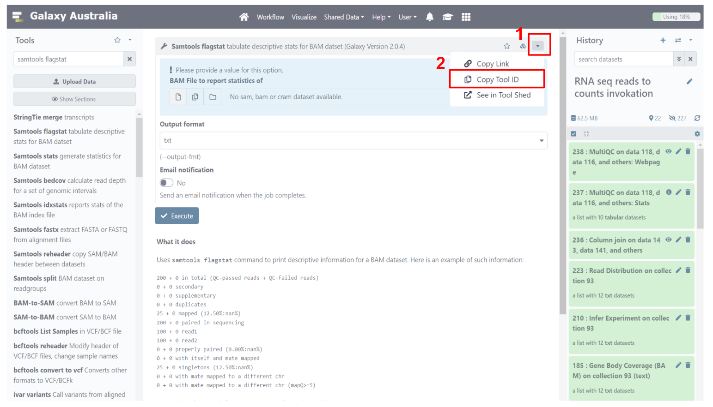

# Samtools Flagstat Tool Translation

## Introduction

This tutorial demonstrates translation of a basic `samtools flagstat` Galaxy Tool Wrapper to Nextflow using `janis translate`. <br>

**Source Tool**

The Galaxy Tool Wrapper used in this tutorial was created by contributors to the [Galaxy Devteam repository](https://github.com/galaxyproject/tools-devteam) of tools. 

The underlying software used in the Galaxy Tool Wrapper - [samtools_flagstat](http://www.htslib.org/doc/samtools-flagstat.html) - displays summary information for an alignment file. 

**Tutorial Outcomes**

In this tutorial we will:
- Install the required software
- Translate the Galaxy Tool Wrapper to Nextflow using `janis translate`
- Make manual adjustments to the translation if necessary
- Run the nextflow using sample input data to validate our nextflow code

After completing this short tutorial, you will be familiar with using `janis translate` to migrate workflow Galaxy Tool Wrappers to Nextflow.

Other tutorials exist to demonstrate migration from WDL / CWL / Galaxy -> Nextflow in this repository, including full workflow migrations with multiple tasks. 

**Installation**

To begin, make sure you have [nextflow](https://nf-co.re/usage/installation), [docker](https://docs.docker.com/engine/install/), and [janis translate](https://janis.readthedocs.io/en/latest/index.html) installed. <br>
The links above contain installation instructions. 

<br>


## Janis Translate

To translate a workflow,  we use `janis translate`.

```
janis translate --from <src> --to <dest> <filepath>
```

The `--from` specifies the workflow language of the source file(s), and `--to` specifies the destination we want to translate to. 

In our case, we want to translate a Galaxy -> Nextflow. 

Aside from local filepaths, `janis translate` can also access Galaxy Tool Wrappers using a tool ID. <br>
We will use this method in this tutorial. 

To get the `samtools_flagstat` Tool ID, navigate to the tool using any usegalaxy.org server. <br>
The following is a link to the samtools flagstat tool in Galaxy Australia: <br> https://usegalaxy.org.au/root?tool_id=toolshed.g2.bx.psu.edu/repos/devteam/samtools_flagstat/samtools_flagstat/2.0.4. 

Once here, we will copy the Tool ID. 



At time of writing, the current Tool ID for the `samtools_flagstat` tool wrapper is *toolshed.g2.bx.psu.edu/repos/devteam/samtools_flagstat/samtools_flagstat/2.0.4*

Now we have the Tool ID, we can access & translate this Galaxy Tool Wrapper to a Nextflow process. 

<br>

*using pip*

To translate the `samtools_flagstat` tool wrapper to nextflow, we can write the following in a shell:
```
janis translate --from cwl --to nextflow toolshed.g2.bx.psu.edu/repos/devteam/samtools_flagstat/samtools_flagstat/2.0.4
```

*using docker (linux bash)*

If the janis translate docker container is being used, we can write the following:
```
docker run -v $(pwd):/home janis translate --from cwl --to nextflow \ toolshed.g2.bx.psu.edu/repos/devteam/samtools_flagstat/samtools_flagstat/2.0.4
```

<br>

Once complete, you will see a folder called `translated` appear, and a nextflow process called `samtools_flagstat.nf` will be present inside. 

For your own reference / interest, the actual Galaxy Tool Wrapper files will be downloaded during translation & present in `translated/source`. 

<br>

## Manual Adjustments

The `translated/samtools_flagstat.nf` file should be similar to the following: 

```
nextflow.enable.dsl=2

process SAMTOOLS_FLAGSTAT {
    
    container "quay.io/biocontainers/samtools:1.13--h8c37831_0"

    input:
    path input1
    val at

    output:
    stdout emit: output1

    script:
    """
    samtools flagstat \
    --output-fmt "txt" \
    -@ ${at} \
    ${input1} \
    """

}
```

We can see that this nextflow process has two inputs, a single output, and calls `samtools flagstat`.  

By viewing the [samtools_flagstat](http://www.htslib.org/doc/samtools-flagstat.html) documentation, we see the following: 
```
samtools flagstat in.sam|in.bam|in.cram

-@ INT
Set number of additional threads to use when reading the file.

--output-fmt/-O FORMAT
Set the output format. FORMAT can be set to `default', `json' or `tsv' to select the default, JSON or tab-separated values output format. If this option is not used, the default format will be selected.
```

By matching up the process `inputs:` section and the `script:` section, we can see that:
- `path input1` will be the input `sam | bam | cram`
- `val at` will be the threads argument passed to `-@`
- the `--output-fmt` option has been assigned the default value of `"txt"`

We can also see that a container image is available for this tool. In the next section we will run this process using some sample data and the specified container. 

This translation is correct for the `samtools_flagstat.cwl` file and needs no adjusting. <br>

If you would like to expose the `--output-fmt` option as a process input, you can do the following:
- add a `val` input to the process 
- substitute its name instead of hardcoded `"txt"` value in the script: e.g. `--output-fmt ${name}`

<br>

## Running Samtools Flagstat as a Workflow

<br>

**Setting up nextflow.config**

To run this process, we will set up a `nextflow.config` file and add some lines to the top of our process definition to turn it into a workflow.

Create a new file called `nextflow.config` in the `translated` folder alongside `samtools_flagstat.nf`. 

Copy and paste the following code into your `nextflow.config` file: 

```
nextflow.enable.dsl = 2
docker.enabled = true

params {
    bam = "../../../../sample_data/galaxy/samtools_flagstat_tool/samtools_flagstat_input1.bam"
    threads = 1
}
```
<br>

This tells nextflow how to run, and sets up inputs parameters we can use to supply values to the `SAMTOOLS_FLAGSTAT` process. 

The `bam` parameter is the input bam file we wish to analyse. <br>
We are using sample data located in the `sample_data/` folder at the top level of the `janis-translate-examples` repository.  <br>

The `threads` parameter is an integer. <br>
It which controls how many additional compute threads to use when reading the input bam. 

From here, we can refer to these inputs as `params.bam` / `params.threads` in other files.

> NOTE<br>
> `nextflow.enable.dsl=2` ensures that we are using the dsl2 nextflow syntax which is the current standard. <br>
> `docker.enabled = true` tells nextflow to run processes using docker. Our `samtools_flagstat.nf` has a directive with the form `container "quay.io/biocontainers/samtools:1.13--h8c37831_0"` provided, so it will use the specified image when running this process. 

<br>

**Creating Workflow & Passing Data** 

Now that we have the `nextflow.config` file set up, we will add a few lines to `samtools_flagstat.nf` to turn it into a workflow. 

Copy and paste the following lines at the top of `samtools_flagstat.nf`:

```
nextflow.enable.dsl=2

ch_bam = Channel.fromPath( params.bam )

workflow {
    SAMTOOLS_FLAGSTAT(
        ch_bam,             // input1 
        params.threads      // at
    )
    SAMTOOLS_FLAGSTAT.out.output1.view()
}
```

The first line creates a nextflow `Channel` for our `bam` input. <br>
The `params.bam` global variable we set up previously is used to supply the 
path to our sample data.

The new `workflow {}` section declares the main workflow entry point. <br>
When we run this file, nextflow will look for this section and run the workflow contained within. 

In our case, the workflow only contains a single task, which runs the `SAMTOOLS_FLAGSTAT` process defined below the workflow section. We then supply input values to `SAMTOOLS_FLAGSTAT` using our `ch_bams` channel we created for `input1`, and `params.threads` for the `at` input.

<br>

**Running Our Workflow**

Ensure you are in the `translated/` working directory, where `nextflow.config` and `samtools_flagstat.nf` reside. 

```
cd translated/
```

To run the workflow using our sample data, we can now write the following command: 
```
nextflow run samtools_flagstat.nf
```

Nextflow will automatically check if there is a `nextflow.config` file in the working directory, and if so will use that to configure itself. Our inputs are supplied in `nextflow.config` alongside the dsl2 & docker config, so it should run without issue. 

Once completed, the stdout from `SAMTOOLS_FLAGSTAT` should appear in your shell. 

If everything went well, you should see text similar to the following: 

```
200 + 0 in total (QC-passed reads + QC-failed reads)
200 + 0 primary
0 + 0 secondary
0 + 0 supplementary
0 + 0 duplicates
0 + 0 primary duplicates
25 + 0 mapped (12.50% : N/A)
25 + 0 primary mapped (12.50% : N/A)
200 + 0 paired in sequencing
100 + 0 read1
100 + 0 read2
0 + 0 properly paired (0.00% : N/A)
0 + 0 with itself and mate mapped
25 + 0 singletons (12.50% : N/A)
0 + 0 with mate mapped to a different chr
0 + 0 with mate mapped to a different chr (mapQ>=5)
```

If needed, you can check the `./final` folder which contains the files we created in this tutorial.  

<br>

### Conclusion

In this tutorial we explored how to translate a simple Galaxy Tool to a Nextflow process. 

A tutorial for a more complex Galaxy Tool Wrapper translation is available in the `galaxy/tools/limma_voom` folder. 

A tutorial for a Galaxy workflow translation to Nextflow is available in the `galaxy/workflows/rnaseq_reads_to_counts` folder. 