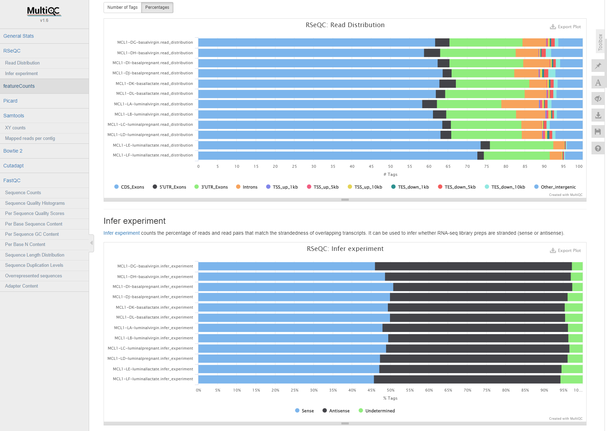

# RNA-Seq Reads to Counts Translation

## Introduction

This tutorial demonstrates translation of a challenging Galaxy workflow to Nextflow using `janis translate`. 

The workflow we will translate in this tutorial accepts raw RNA-seq reads as input, and produces gene counts for further analysis (eg. differential expression).

Many of the Galaxy Tool Wrappers used in this workflow are challenging. They may:
- Contain complex execution logic
- Perform multiple commands
- Use inbuilt Galaxy data for reference genomes, indexes, and annotation information.

In these situations, the translated files produced by `janis translate` will need manual invertention to run. 


<br>


**Source Workflow**

The workflow used in this tutorial is taken from the [Galaxy Training Network (GTN)](https://training.galaxyproject.org/training-material/) resource which provides tutorials on how to use Galaxy for bioinformatic analysis. 

The GTN has over 100 tutorials demonstrating how to use the Galaxy platform to analyse data, and is definitely worth having a look! 

The specific workflow we use today is from the [RNA-Seq reads to counts](https://training.galaxyproject.org/training-material/topics/transcriptomics/tutorials/rna-seq-reads-to-counts/tutorial.html) page, which provides detailed instruction on how to turn raw RNA-seq reads into gene counts. <br>


<br>

**Tutorial Outcomes**

In this tutorial we will:
- Install the required software
- Obtain the Galaxy workflow
- Translate the Galaxy workflow to Nextflow using `janis translate`
- Make manual adjustments to the translation where needed
- Run the Nextflow workflow using sample input data to validate our translation

After completing this short tutorial, you will be familiar with using `janis translate` to migrate workflows in Galaxy to Nextflow.

Other tutorials exist to demonstrate migration from WDL / CWL / Galaxy -> Nextflow in this repository.

<br>

**Installation**

To begin, make sure you have [nextflow](https://nf-co.re/usage/installation), [docker](https://docs.docker.com/engine/install/), and [janis translate](https://janis.readthedocs.io/en/latest/index.html) installed. <br>
The links above contain installation instructions. 

<br>

## Janis Translate

**Obtain the Workflow**

Galaxy workflows can be found in a number of places. 

Today, we will use the workflow provided from the GTN RNA-Seq reads to counts tutorial. <br>
The workflow can be downloaded using [this link](https://training.galaxyproject.org/training-material/topics/transcriptomics/tutorials/rna-seq-reads-to-counts/workflows/rna-seq-reads-to-counts.ga).

The downloaded `.ga` workflow is also included in the local `source/` folder if needed. 

<br>

*(for your information)*

Galaxy servers each have [shared workflows](https://usegalaxy.org.au/workflows/list_published) where you can search for a community workflow which suits your needs. The link above is to the Galaxy Australia server shared workflows page, which contains hundreds of workflows which users have made public. 


<br>

The [Galaxy Training Network (GTN)](https://training.galaxyproject.org/training-material/) also provides workflows for their training tutorials. These are useful because the topics covered are common analyses users wish to perform. 


<br>

Additionally, you can create your own workflow using the [Galaxy Workflow Editor](https://usegalaxy.org.au/workflows/list) then download your creation. 


<br>

**Run Janis Translate**

To translate a workflow,  we use `janis translate`.

```
janis translate --from <src> --to <dest> <filepath>
```

The `--from` specifies the workflow language of the source file(s), and `--to` specifies the destination we want to translate to. 

In our case, we want to translate Galaxy -> Nextflo. <br>
Our source Galaxy file is wherever you downloaded the `.ga` to, or alternatively at `source/rna-seq-reads-to-counts.ga` relative to this document.

<br>

*using pip*

To translate `rna-seq-reads-to-counts.ga` to nextflow, we can write the following in a shell:
```
janis translate --from galaxy --to nextflow source/rna-seq-reads-to-counts.ga
```

*using docker (linux bash)*

If the janis translate docker container is being used, we can write the following:
```
docker run -v $(pwd):/home janis translate --from galaxy --to nextflow source/rna-seq-reads-to-counts.ga
```

<br>

**Translation Output**

The output translation will contain multiple files and directories.<br>
You will see a folder called `translated` appear - inside this folder, we should see the following structure:

```
translated
├── main.nf                             # main workflow (rna_seq_reads_to_counts)
├── modules                             # folder containing nextflow processes
│   ├── collection_column_join.nf
│   ├── cutadapt.nf
│   ├── fastqc.nf
│   ├── featurecounts.nf
│   ├── hisat2.nf
│   ├── multiqc.nf
│   ├── picard_mark_duplicates.nf
│   ├── rseqc_gene_body_coverage.nf
│   ├── rseqc_infer_experiment.nf
│   ├── rseqc_read_distribution.nf
│   └── samtools_idxstats.nf
├── nextflow.config                     # config file to supply input information
├── source                              # folder containing galaxy tool wrappers used to translate tools
├── subworkflows                        # folder containing nextflow subworkflows
└── templates                           # folder containing any scripts used by processes
    ├── collection_column_join_script
    └── multiqc_config
```

Now we have performed translation using `janis translate`, we need to check the translated workflow for correctness.  

From here, we will do a test-run of the workflow using sample data, and make manual adjustments to the translated workflow where needed. 

<br>

## Running the Translated Workflow

<br>

**Inspect main.nf**

The main workflow translation appears as `main.nf` in the `translated/` folder. <br>

This filename is just a convention, and we use it to provide clarity about the main entry point of the workflow. <br>
In our case `main.nf` holds the nextflow definition for the  `rna-seq-reads-to-counts.ga` workflow. 

> NOTE: <br>
> Before continuing, feel free to have a look at the other nextflow files which have been generated during translation:<br>
> Each Galaxy tool appears as a nextflow process in the `translated/modules/` directory. 
> Each script used by nextflow processes appear in the `translated/templates/` directory.
> Each Galaxy Tool Wrapper used during translation appears in the `translated/source/` directory. 

In `main.nf` we see imports for nextflow processes called by the main workflow:

```
include { FASTQC as FASTQC1 } from './modules/fastqc'
include { CUTADAPT } from './modules/cutadapt'
include { FASTQC as FASTQC2 } from './modules/fastqc'
include { HISAT2 } from './modules/hisat2'
include { FEATURECOUNTS } from './modules/featurecounts'
include { PICARD_MARK_DUPLICATES } from './modules/picard_mark_duplicates'
include { SAMTOOLS_IDXSTATS } from './modules/samtools_idxstats'
include { RSEQC_GENE_BODY_COVERAGE } from './modules/rseqc_gene_body_coverage'
include { RSEQC_INFER_EXPERIMENT } from './modules/rseqc_infer_experiment'
include { RSEQC_READ_DISTRIBUTION } from './modules/rseqc_read_distribution'
include { COLLECTION_COLUMN_JOIN } from './modules/collection_column_join'
include { MULTIQC } from './modules/multiqc'
```

We also see that some nextflow `Channels` and other variables have been set up. 

Channels are used to supply data according to nextflow's adoption of the *dataflow* programming model.
The other variable definitions ensure that file input parameters are being treated as *files* by nextflow, so that they are staged properly in the process working directory. 
```
// data which will be passed as channels
ch_in_input_fastqs_collection  = Channel.fromPath( params.in_input_fastqs_collection ).toList()

// data which will be passed as variables
collection_column_join_script  = file( params.collection_column_join_script )
fastqc1_contaminants           = file( params.fastqc1_contaminants )
fastqc1_limits                 = file( params.fastqc1_limits )
fastqc2_contaminants           = file( params.fastqc2_contaminants )
fastqc2_limits                 = file( params.fastqc2_limits )
in_input_reference_gene_bed    = file( params.in_input_reference_gene_bed )
multiqc_config                 = file( params.multiqc_config )
```

> Note: `.toList()` <br><br>
> Nextflow queue channels work differently to lists. <br>
> Instead of supplying all items together, queue channels emit each item separately. <br> 
> This results in a separate task being spawned for each item in the queue when the channel is used. <br>
> As the Galaxy workflow specifies the `in_input_fastqs_collection` is a list of fastq files, we use `.toList()` to group all items as a sole emission. <br>
> This mimics an array which is the datatype of the `in_input_fastqs_collection` input. <br><br>
> As it turns out, the Galaxy workflow ends up running most steps in parallel across the `in_input_fastqs_collection` input. <br><br>
> Parallelisation in nextflow happens by default. <br>
> To facilitate this, the `.flatten()` method is called on `ch_in_input_fastqs_collection` when used in the `FASTQC1` and `CUTADAPT` tasks. <br>
> This emits items in `ch_in_input_fastqs_collection` individually, spawning a new task for each file. <br><br>
> Because other tasks use the output of `CUTADAPT`, they will also run in parallel per file.<br>
> We're kinda doing redundant work by calling `.toList()`, then `.flatten()`, but `janis translate` isn't smart enough yet to detect this at present. 

<br>

Now that we have covered imports and dataflow, we can look at the main `workflow` section. The main workflow is captured in the `workflow {}` section and has 12 tasks. 

Each task has been supplied values according to the source workflow. <br>
Comments display the name of the process input which is being fed a particular value. 

Compare the main `workflow {}` section with the following visualisation of our Galaxy workflow (using the Galaxy workflow editor).

main.nf
```
workflow {

    FASTQC1(
        ch_in_input_fastqs_collection.flatten(),  // input_file
        fastqc1_contaminants,                     // contaminants
        fastqc1_limits,                           // limits
        params.fastqc1_format_string,             // format_string
        params.fastqc1_outdir                     // outdir
    )

    CUTADAPT(
        ch_in_input_fastqs_collection.flatten()  // library_input_1
    )

    FASTQC2(
        CUTADAPT.out.out12,            // input_file
        fastqc2_contaminants,          // contaminants
        fastqc2_limits,                // limits
        params.fastqc2_format_string,  // format_string
        params.fastqc2_outdir          // outdir
    )

    HISAT2(
        CUTADAPT.out.out12,        // library_input_1
        params.hisat2_index_path,  // index_path
        params.hisat2_read11       // read11
    )

    FEATURECOUNTS(
        HISAT2.out.output_alignments  // alignment
    )

    PICARD_MARK_DUPLICATES(
        HISAT2.out.output_alignments  // input_file
    )

    SAMTOOLS_IDXSTATS(
        HISAT2.out.output_alignments,        // input_bam
        params.samtools_idxstats_addthreads  // addthreads
    )

    RSEQC_GENE_BODY_COVERAGE(
        HISAT2.out.output_alignments,             // batch_mode_input
        in_input_reference_gene_bed,              // refgene
        params.rseqc_gene_body_coverage_safename  // safename
    )

    RSEQC_INFER_EXPERIMENT(
        HISAT2.out.output_alignments,  // input_bam
        in_input_reference_gene_bed    // refgene
    )

    RSEQC_READ_DISTRIBUTION(
        HISAT2.out.output_alignments,  // input_bam
        in_input_reference_gene_bed    // refgene
    )

    COLLECTION_COLUMN_JOIN(
        FEATURECOUNTS.out.output_short.toList(),  // input_tabular
        collection_column_join_script             // collection_column_join_script
    )

    MULTIQC(
        multiqc_config,                               // multiqc_config
        FASTQC2.out.out_text_file,                    // unknown1
        CUTADAPT.out.out_report,                      // unknown2
        RSEQC_INFER_EXPERIMENT.out.outputTextfile,    // unknown3
        PICARD_MARK_DUPLICATES.out.out_metrics_file,  // unknown4
        SAMTOOLS_IDXSTATS.out.outputTabular,          // unknown5
        RSEQC_GENE_BODY_COVERAGE.out.outputtxt,       // unknown6
        RSEQC_READ_DISTRIBUTION.out.outputTextfile,   // unknown7
        FEATURECOUNTS.out.output_summary,             // unknown8
        HISAT2.out.out_summary_file                   // unknown9
    )

}
```

<br>

Galaxy Workflow


For this workshop, we will ignore the `COLLECTION_COLUMN_JOIN` task. 
Instead of joining the results of `FEATURECOUNTS`, we will just pass all final files to `MULTIQC`. 

⚡ <font color='Orange'>**TASK**</font> <br>
>Comment out or delete the COLLECTION_COLUMN_JOIN task call from `main.nf`.<br>
>It should now look similar to the following:<br>
>```
>// COLLECTION_COLUMN_JOIN(
>//     FEATURECOUNTS.out.output_short.toList(),  // input_tabular
>//     collection_column_join_script             // collection_column_join_script
>// )
>```

⚡ <font color='Orange'>**TASK**</font> <br>
>Append .toList() for each input of the `MULTIQC` task in `main.nf`, except multiqc_config.<br>
>It should now look similar to the following: <br>
>```
>MULTIQC(
>       multiqc_config,                               // multiqc_config
>       FASTQC2.out.out_text_file.toList(),                    // unknown1
>       CUTADAPT.out.out_report.toList(),                      // unknown2
>       RSEQC_INFER_EXPERIMENT.out.outputTextfile.toList(),    // unknown3
>       PICARD_MARK_DUPLICATES.out.out_metrics_file.toList(),  // unknown4
>       SAMTOOLS_IDXSTATS.out.outputTabular.toList(),          // unknown5
>       RSEQC_GENE_BODY_COVERAGE.out.outputtxt.toList(),       // unknown6
>       RSEQC_READ_DISTRIBUTION.out.outputTextfile.toList(),   // unknown7
>       FEATURECOUNTS.out.output_summary.toList(),             // unknown8
>       HISAT2.out.out_summary_file.toList()                   // unknown9
>)
>```

<br>

Now that we have looked at `main.nf`, let's set up inputs to run our translated Nextflow workflow. 
To do this we will supply sample data using the global `params` variable in `nextflow.config`.

<br>

**Inspect nextflow.config**

To test the translated workflow, we will first set up workflow inputs in `nextflow.config`. 

Before running a workflow, nextflow will attempt to open `nextflow.config` and read in config information and global *param* variables from this file. 
We use this file to tell nextflow how to run and to supply workflow inputs.

Inside the `translated/` folder you will see that `nextflow.config` is already provided. 

Janis translate creates this file to provide clarity about the necessary workflow inputs, and to set some other config variables. 

Open `nextflow.config` and have a look at the contents. It should look similar to the following: 

```
nextflow.enable.dsl=2
docker.enabled = true

params {
    
    // Placeholder for null values.
    // Do not alter unless you know what you are doing.
    NULL_VALUE = 'NULL'

    // WORKFLOW OUTPUT DIRECTORY
    outdir  = './outputs'

    // INPUTS (MANDATORY)
    collection_column_join_script      = NULL_VALUE  // (MANDATORY generic file)  
    in_input_fastqs_collection         = []          // (MANDATORY array)         eg. [file1, ...]
    in_input_reference_gene_bed        = NULL_VALUE  // (MANDATORY generic file)  
    multiqc_config                     = NULL_VALUE  // (MANDATORY generic file)  
    fastqc1_format_string              = NULL_VALUE  // (MANDATORY string)        
    fastqc1_outdir                     = NULL_VALUE  // (MANDATORY string)        
    fastqc2_format_string              = NULL_VALUE  // (MANDATORY string)        
    fastqc2_outdir                     = NULL_VALUE  // (MANDATORY string)        
    hisat2_index_path                  = NULL_VALUE  // (MANDATORY string)        
    hisat2_read11                      = NULL_VALUE  // (MANDATORY string)        
    rseqc_gene_body_coverage_safename  = NULL_VALUE  // (MANDATORY string)        
    samtools_idxstats_addthreads       = NULL_VALUE  // (MANDATORY string)        

    // INPUTS (OPTIONAL)
    fastqc1_contaminants  = NULL_VALUE  // (optional tabular)   
    fastqc1_limits        = NULL_VALUE  // (optional textfile)  
    fastqc2_contaminants  = NULL_VALUE  // (optional tabular)   
    fastqc2_limits        = NULL_VALUE  // (optional textfile)  

}
```

> NOTE: `NULL_VALUE = 'NULL'`<br><br>
> Nextflow doesn't like `null` values to be passed to process inputs. <br>
> This is a challenge for translation as other languages allow `optional` inputs. <br>
> To get around this, Janis Translate sets the `params.NULL_VALUE` variable as a `null` placeholder for `val` type inputs. <br>
> You will see this being used in nextflow processes to do optionality checking.

<br>

The auto-generated `nextflow.config` splits up workflow inputs using some headings. <br>

```
# Workflow inputs which are mandatory
// INPUTS (MANDATORY)

# Workflow inputs which are optional
// INPUTS (OPTIONAL)
```

To run the workflow, we will supply values for the mandatory workflow inputs, and leave the optional inputs as-is. 

<br>

**Setting up Workflow Inputs**

We need to supply values for those under the `// INPUTS (MANDATORY)` heading. 

Here is an explanation of the role of these inputs:

```
collection_column_join_script      # path to script needed by COLLECTION_COLUMN_JOIN
in_input_fastqs_collection         # .fastq format input reads (.gz ok)
in_input_reference_gene_bed        # .bed format gene annotations
multiqc_config                     # path to script needed by MULTIQC
fastqc1_format_string              # string to supply the input format -f to FASTQC1
fastqc1_outdir                     # string to supply the outputs folder for FASTQC1
fastqc2_format_string              # string to supply the input format -f to FASTQC2
fastqc2_outdir                     # string to supply the outputs folder for FASTQC2
hisat2_index_path                  # path to hisat2 index for HISAT2
hisat2_read11                      # ?
rseqc_gene_body_coverage_safename  # ?
samtools_idxstats_addthreads       # value for the -@ threads argument for SAMTOOLS_IDXSTATS
```

<br>

Sample data for the `.fastq` and `.bed` inputs have been provided in the `sample_data` directory at the top level of this repository. 

The scripts will have been copied by `janis translate` and placed in the `translated/templates` folder. 

Replace the `// INPUTS (MANDATORY)` section of `nextflow.config` with the following text to set up our sample data as workflow inputs:

```
// INPUTS (MANDATORY)
collection_column_join_script      = "templates/collection_column_join_script"
in_input_fastqs_collection     = [
    "../../../../sample_data/galaxy/rnaseq_reads_to_counts_workflow/MCL1-DG-basalvirgin.fastq.gz",
    "../../../../sample_data/galaxy/rnaseq_reads_to_counts_workflow/MCL1-DH-basalvirgin.fastq.gz",
    "../../../../sample_data/galaxy/rnaseq_reads_to_counts_workflow/MCL1-DI-basalpregnant.fastq.gz",
    "../../../../sample_data/galaxy/rnaseq_reads_to_counts_workflow/MCL1-DJ-basalpregnant.fq.gz",
    "../../../../sample_data/galaxy/rnaseq_reads_to_counts_workflow/MCL1-DK-basallactate.fastq.gz",
    "../../../../sample_data/galaxy/rnaseq_reads_to_counts_workflow/MCL1-DL-basallactate.fastq.gz",
    "../../../../sample_data/galaxy/rnaseq_reads_to_counts_workflow/MCL1-LA-luminalvirgin.fastq.gz",
    "../../../../sample_data/galaxy/rnaseq_reads_to_counts_workflow/MCL1-LB-luminalvirgin.fastq.gz",
    "../../../../sample_data/galaxy/rnaseq_reads_to_counts_workflow/MCL1-LC-luminalpregnant.fastq.gz",
    "../../../../sample_data/galaxy/rnaseq_reads_to_counts_workflow/MCL1-LD-luminalpregnant.fastq.gz",
    "../../../../sample_data/galaxy/rnaseq_reads_to_counts_workflow/MCL1-LE-luminallactate.fastq.gz",
    "../../../../sample_data/galaxy/rnaseq_reads_to_counts_workflow/MCL1-LF-luminallactate.fastq.gz",
]
in_input_reference_gene_bed        = "../../../../sample_data/galaxy/rnaseq_reads_to_counts_workflow/ucsc/mm10_RefSeq.bed"
multiqc_config                     = "templates/multiqc_config"
fastqc1_format_string              = "fastq"
fastqc1_outdir                     = "outdir"
fastqc2_format_string              = "fastq"
fastqc2_outdir                     = "outdir"
hisat2_index_path                  = "../../../../sample_data/galaxy/rnaseq_reads_to_counts_workflow/hisat2_index/*.ht2"
hisat2_read11                      = NULL_VALUE  // (MANDATORY string)  
rseqc_gene_body_coverage_safename  = NULL_VALUE  // (MANDATORY string)    
samtools_idxstats_addthreads       = "2"       
```

Before we supply values, lets look at the inputs which were marked `?` in the explanation of inputs. Specifically, the `hisat2_read11` and `rseqc_gene_body_coverage_safename` params. 

These both seem a bit strange. Hisat2 will receive reads as output from CUTADAPT so why do we need to supply a value? Rseqc is similar - there is no safename argument for the software, so we are unsure what this does. 

<br>

**Investigating hisat2_reads11 parameter**

Open `modules/hisat2.nf` to look at its process definition. It should look similar to the following: 
```
process HISAT2 {
    
    container "quay.io/biocontainers/hisat2:2.2.1--h87f3376_5"
    publishDir "${params.outdir}/hisat2"

    input:
    path library_input_1
    val index_path
    val read11

    output:
    path "summary.txt", emit: out_summary_file
    path "unknown_collection_pattern", emit: output_alignments

    script:
    """
    hisat2 \
    ${library_input_1} \
    -U ${read11} \
    -x ${index_path} \
    """

}
```

It's clear that `janis translate` has gotten a bit confused here.

From looking at `main.nf`, we see that the output of CUTADAPT is being fed to the `library_input_1` process input of HISAT2. 
The input reads are therefore arriving as `library_input_1` rather than `read11`. 

In the `script:` section of HISAT2 we see what is going on. <br>
The `read11` input is being fed to `-U`, but this should instead be `library_input_1`. <br>
`read11` appears to be the same role as `library_input_1` and looks like a temporary variable the source tool used. 

>Why does this happen?<br>
>Galaxy often uses temporary variables to configure / sanitise values.<br>
>It's common for Galaxy tools to reassign an input to a temporary value, then pass that temp value to the actual software command. <br>
>Here the Galaxy hisat2 tool has created a temporary variable (read11) then passes that to hisat2 rather than the original input. 

<br>

To fix this, we will first remove the `read11` HISAT2 process input.

>⚡ <font color='Orange'>**TASK**</font> <br>
>Remove the `hisat2_read11` param in `nextflow.config`. <br>
>Remove the value being passed to `read11` in `main.nf`. <br>
>Remove the `read11` process input from HISAT2. <br>
>Your HISAT2 inputs section should now look similar to the following:<br>
>```
>input:
>path library_input_1
>val index_path
>```
>The task call in `main.nf` should look similar to the following: <br>
>```
>HISAT2(
>    CUTADAPT.out.out12,        // library_input_1
>    params.hisat2_index_path,  // index_path
>)

<br>

Next we will swap `read11` with `library_input_1` in the script section.  

>⚡ <font color='Orange'>**TASK**</font> <br>
>Swap `read11` with `library_input_1` in the HISAT2 script section. <br>
>Remove the original line referencing `library_input_1`. <br>
>Supply the hisat2 `--summary-file` argument to specify the output summary txt file name<br>
>Supply the hisat2 `-S` argument to specify the name of the produced SAM file. <br><br>
>Your script section should now look similar to the following:<br>
>```
>script:
>"""
>hisat2 \
>-U ${library_input_1} \
>-x ${index_path} \
>--summary-file summary.txt \
>-S out.sam
>"""
>```

<br>

While we're here, we will also add some samtools commands as downstream tasks required a *sorted & indexed BAM*, not a SAM file which is the default output of `hisat2`. 

>⚡ <font color='Orange'>**TASK**</font> <br>
>Add samtools commands to convert the output SAM to BAM, then sort and index the file. <br><br>
>Your script section should now look similar to the following: 
>```
>script:
>"""
>hisat2 \
>-U ${library_input_1} \
>-x ${index_path} \
>--summary-file summary.txt \
>-S out.sam
>
>samtools view out.sam -o out.bam
>samtools sort out.bam -o sorted.bam
>samtools index sorted.bam -o sorted.bam.bai
>mv sorted.bam alignment.bam 
>mv sorted.bam.bai alignment.bam.bai
>"""

<br>

As a final change, we will modify the collection pattern for the `output_alignments` output in HISAT2. 

In the example above we have named the output `alignment.bam`, so will update the collection pattern accordingly. If you have chosen a different name, make sure the correct file is being collected by `output_alignments`. 

>⚡ <font color='Orange'>**TASK**</font> <br>
>Change the collection pattern for `output_alignments` to collect you sorted & indexed BAM file. <br>
>The HISAT2 outputs section should now look similar to the following:<br>
>```
>output:
>path "summary.txt", emit: out_summary_file
>path "alignment.bam", emit: output_alignments
>```

<br>

**Investigating rseqc_gene_body_coverage_safename parameter**

Now that we have fixed up HISAT2 inputs and script, let's do the same for 
the `rseqc_gene_body_coverage_safename` param. 

Open `rseqc_gene_body_coverage.nf` to look at the process definition. <br>
It should look similar to the following:
```
process RSEQC_GENE_BODY_COVERAGE {
    
    container "quay.io/biocontainers/rseqc:2.6.4--py27hf8a1672_2"
    publishDir "${params.outdir}/rseqc_gene_body_coverage"

    input:
    path batch_mode_input
    path refgene
    val safename

    output:
    path "output.geneBodyCoverage.curves.pdf", emit: outputcurvespdf
    path "output.geneBodyCoverage.txt", emit: outputtxt

    script:
    """
    geneBody_coverage.py \
    ${batch_mode_input} \
    -r ${refgene} \
    -i ${safename} \
    """

}
```

We see an identical situation as encountered for HISAT2. <br>
The `safename` process input is actually just a Galaxy temporary value, and takes the role of `batch_mode_input`. 

Let's fix up RSEQC_GENE_BODY_COVERAGE similar to HISAT2. <br>

>⚡ <font color='Orange'>**TASK**</font> <br>
>Remove the `rseqc_gene_body_coverage_safename` param in `nextflow.config`. <br>
>Remove the value being passed to `safename` in `main.nf`. <br>
>Remove the `safename` process input from `RSEQC_GENE_BODY_COVERAGE`. <br>
>Swap `safename` for `batch_mode_input` in the script, and remove the original reference to `batch_mode_input`.<br>
>Additionally, add the `-o` argument to the script section to set an output filename.<br><br>
>The task call for `RSEQC_GENE_BODY_COVERAGE` in `main.nf` should now look similar to the following:<br>
>```
>RSEQC_GENE_BODY_COVERAGE(
>    HISAT2.out.output_alignments,             // batch_mode_input
>    in_input_reference_gene_bed,              // refgene
>    // params.rseqc_gene_body_coverage_safename  // safename
>)
>```
>
>Your `RSEQC_GENE_BODY_COVERAGE` process in `modules/rseqc_gene_body_coverage.nf` should now look similar to the following:<br>
>```
>process RSEQC_GENE_BODY_COVERAGE {
>    
>    container "quay.io/biocontainers/rseqc:2.6.4--py27hf8a1672_2"
>    publishDir "${params.outdir}/rseqc_gene_body_coverage"
>
>    input:
>    path batch_mode_input
>    path refgene
>
>    output:
>    path "output.geneBodyCoverage.curves.pdf", emit: outputcurvespdf
>    path "output.geneBodyCoverage.txt", emit: outputtxt
>
>    script:
>    """
>    geneBody_coverage.py \
>    -r ${refgene} \
>    -i ${batch_mode_input} \
>    -o output \
>    """
>
>}
>```


<br>


**Run the Workflow**

Now that we have set up our sample data and made a few changes to the workflow, lets run it to see where we stand. 

Ensure you are in the `translated/` working directory, where `nextflow.config` and `main.nf` reside. 

If not, use the following to change directory. 
```
cd translated/
```

To run the workflow using our sample data, we can now write the following command: 
```
nextflow run main.nf
```

While the workflow runs, you will encounter this error:

```
Caused by:
  Process `FASTQC1 (9)` terminated with an error exit status (2)

Command executed:
  fastqc               --outdir outdir     -f fastq     MCL1-LC-luminalpregnant.fastq.gz

Command error:
  Specified output directory 'outdir' does not exist
```

This is somewhat expected. Janis translate doesn't produce perfect translations - just the best it can do. <br>
This is the first of multiple errors we will encounter and fix while making this workflow runnable. 


<br>

## Manual Adjustments

### Error 1: FASTQC outdir

The first issue we need to address is caused by the FASTQC process translation. 

**Error message**
```
Caused by:
  Process `FASTQC1 (9)` terminated with an error exit status (2)

Command executed:
  fastqc               --outdir outdir     -f fastq     MCL1-LC-luminalpregnant.fastq.gz

Command error:
  Specified output directory 'outdir' does not exist
```

<br>

**Diagnosing the error**

This message tells us that FastQC was trying to place files in `outdir/` folder of the process working directory, but no such folder existed. 

Nextflow task errors can be broken down accordingly:
```
Error executing process > 'FASTQC1 (9)'     # Main error heading
Caused by:                                  # Task which experienced the error
Command executed:                           # Final shell command which was executed
Command exit status:                        # Exit code for the executed command
Command output:                             # Stdout for the executed command
Command error:                              # Stderr for the executed command
Work dir:                                   # The process working directory
```

By re-reading the error message provided by Nextflow, we see that FASTQC1 experienced an error. 
```
Process `FASTQC1 (9)` terminated with an error exit status (2)
```

We can also see the exact shell command which was executed (yours may have a different fastq): 
```
fastqc --outdir outdir -f fastq MCL1-LC-luminalpregnant.fastq.gz
```

Finally we see that the FastQC software threw the error, rather than Nextflow:
```
Command error:
Specified output directory 'outdir' does not exist
```

From the above, we can understand that the folder we specify using `--outdir` must exist before FastQC runs. 

<br>

**Solution**

Let's update the FASTQC process definition in `modules/fastqc.nf` so this directory is created before fastqc runs. Since we pass the name of this directory as the `outdir` process input, we will use a reference.

>⚡ <font color='Orange'>**TASK**</font> <br>
>Add `mkdir ${outdir}` to the script section of the FASTQC process. <br>
>Make sure it appears before the main `fastqc` command. <br>
>As it is a separate statement, make sure you ***don't*** add `\` after this statement. <br><br>
>Your FASTQC process script should now look similar to the following:<br>
>```
>script:
>def contaminants = contaminants.simpleName != params.NULL_VALUE ? "--contaminants ${contaminants}" : ""
>def limits = limits.simpleName != params.NULL_VALUE ? "--limits ${limits}" : ""
>"""
>mkdir ${outdir}
>fastqc \
>${contaminants} \
>${limits} \
>--outdir ${outdir} \
>-f ${format_string} \
>${input_file} \
>"""
>```


While we are here, let's also adjust the output collection patterns. <br>
When `--outdir` is supplied, FastQC will place its output `.html` and `.zip` file in this directory. 

>⚡ <font color='Orange'>**TASK**</font> <br>
>Adjust the output collection pattern of the FASTQC `out_html_file` and `out_text_file` outputs. <br>
>These files will end in `_fastqc.ext` where `ext` = `html` or `zip`.
>You can use the following text as an example:<br>
>```
>output:
>path "${outdir}/*_fastqc.html", emit: out_html_file
>path "${outdir}/*_fastqc.zip", emit: out_text_file
>```

<br>

>Note<br>
>Nextflow supports ***wildcards*** wherever paths are used. <br>
>Here, `${outdir}/*_fastqc.html` will collect any file which ends in _fastqc.html with `out1`, as `*` matches any text. 

<br>

After you have made the above changes, re-run the workflow using the same command as before:

```
nextflow run main.nf
```

<br>

### Error 2: CUTADAPT output collection

The next error you will experience is due to output collection in the CUTADAPT process. 

**Error message**

```
Error executing process > 'CUTADAPT (11)'

Caused by:
  Missing output file(s) `out1*` expected by process `CUTADAPT (11)`

Command executed:
  cutadapt     MCL1-LE-luminallactate.fastq.gz
```

<br>

**Diagnosing the Error**

The error message above informs us that Nextflow had a problem collecting the outputs of a CUTADAPT task. Cutadapt seems to have run without issue, but Nextflow expected a file starting with `out1` to be present in the process working directory to collect as an output. 

Looking at the `Command output:` section of the error message, you will also see what looks like the contents of a `.fastq` file.  As the `Command output:` component of Nextflow error messages shows us `stdout` during execution, we can gather that the cutadapt output is being sent to stdout, rather than being sent to a file. 

Open `modules/cutadapt.nf` to look at the process definition. <br>
You should see something similar to the following:
```
process CUTADAPT {
    
    container "quay.io/biocontainers/cutadapt:1.16--py35_2"
    publishDir "${params.outdir}/cutadapt"

    input:
    path library_input_1

    output:
    path "out1*", emit: out12
    path "report.txt", emit: out_report

    script:
    """
    cutadapt \
    ${library_input_1} \
    """

}
```

We can see that `cutadapt` is being called using `library_input_1` as input reads. After `cutadapt` has run, the `out12` output is trying to collect a file starting with "out1", and the `out_report` output is trying to collect "report.txt". 

If you are familiar with cutadapt, you will also see that we are not supplying any adapter sequence to remove from reads. 

<br>

**Solution**

Let's update the `input:` section to add an adapters input, the `script:` section to format the command correctly, and the `output:` section to collect our outputs. 

To begin, we will address supplying an adapter sequence to the process. 

>⚡ <font color='Orange'>**TASK**</font> <br>
>Add a new `cutadapt_adapters` param in `nextflow.config` with the value "AGATCGGAAGAGCACACGTCTGAACTCCAGTCAC".<br>
>This section of `nextflow.config` should now look similar to the following:
>```
>samtools_idxstats_addthreads       = "2"       
>cutadapt_adapter                   = "AGATCGGAAGAGCACACGTCTGAACTCCAGTCAC"
>```
>Supply this param as a new value to the CUTADAPT task in `main.nf`. <br>
>The task call should now look similar to the following: <br>
>```
>CUTADAPT(
>    ch_in_input_fastqs_collection.flatten(),  // library_input_1
>    params.cutadapt_adapter
>)
>```
>
>Finally, add a new `val` process input called `adapters` to the CUTADAPT process. <br>
>The CUTADAPT inputs section should now look similar to the following:<br>
>```
>input:
>path library_input_1
>val adapters
>```

<br>

Next we will formulate the script section of CUTADAPT so that the correct command gets executed. <br>
The correct format to run cutadapt is as follows:
```
cutadapt -a AACCGGTT -o out.fastq in.fastq > report.txt
```
When used in this manner, the output fastq is sent to `-o`, and the summary report is sent to `stdout` (collected as "report.txt" above).

>⚡ <font color='Orange'>**TASK**</font> <br>
>Add the `-a` argument to the process script section. Supply a reference to the new `adapters` process input as its value.<br>
>Add the `-o` argument to the process script section. Supply a filename as its value based on the basename of our input reads (`library_input_1`) using `.simpleName`.<br>
>Send `stdout` to a file using a `>` redirect. Supply a filename based on the basename of our input reads as above. <br>
>The script section of CUTADAPT should now look similar to the following:<br>
>```
>script:
>"""
>cutadapt \
>-a ${adapter} \
>-o ${library_input_1.simpleName}.cutadapt.fastq.gz \
>${library_input_1} \
>> ${library_input_1.simpleName}.cutadapt.txt
>"""
>```

<br>

Now that we have fixed the `script:` section of CUTADAPT, we will change the collection pattern for our outputs. 

>⚡ <font color='Orange'>**TASK**</font> <br>
>For the `out12` output, collect the same filename you supplied in the script section with `o-`.<br>
>For the `out_report` output, collect the same filename you supplied in the script section as stdout redirect. <br>
>Your outputs section should now look similar to the following:
>```
>output:
>path "${library_input_1.simpleName}.cutadapt.fastq.gz", emit: out12
>path "${library_input_1.simpleName}.cutadapt.txt", emit: out_report
>```

<br>

After making the changes above, re-run the Nextflow workflow using `nextflow run main.nf`. 

<br>

>NOTE <br>
>Why were these `cutadapt` arguments missed? <br><br>
>The default setting for `janis translate` is to translate tools according to their usage in the workflow. <br>
>This is because Galaxy Tool Wrappers are complex and often have many inputs - most of which aren't relevant to the workflow being translated. <br><br>
>To get the extended tool translation we can use `--mode full` when running janis translate:
>```
>janis translate --from galaxy --to nextflow source/rna_seq_reads_to_counts.ga --mode full
>```
>
>For the `CUTADAPT` process, it will now look similar to the following: 
>```
>nextflow.enable.dsl=2
>
>process CUTADAPT {
>    
>    container "quay.io/biocontainers/cutadapt:1.16--py35_2"
>    publishDir "${params.outdir}/cutadapt"
>
>    input:
>    path library_input_1
>    path info_file
>    path output_file
>    path paired_output
>    path rest_file
>    path too_long_output
>    path too_long_paired_output
>    path too_short_output
>    path too_short_paired_output
>    path untrimmed_output
>    path untrimmed_paired_output
>    path wildcard_file
>    val discard
>    val discard_untrimmed
>    val mask_adapter
>    val match_read_wildcards
>    val no_indels
>    val no_trim
>    val trim_n
>    val error_rate
>    val length
>    val length_tag
>    val max_n
>    val maximum_length
>    val minimum_length
>    val nextseq_trim
>    val option_j
>    val option_u
>    val option_u
>    val overlap
>    val pair_filter
>    val prefix
>    val quality_cutoff
>    val read1
>    val read2
>    val suffix
>    val times
>
>    output:
>    path "out1*", emit: out1
>    path "out2*", emit: out2
>    path "info_file.txt", emit: out_info_file
>    path "report.txt", emit: out_report
>    path "rest_output.fastqsanger", emit: out_rest_output
>    path "too_long_output.fastqsanger", emit: out_too_long_output
>    path "too_long_paired_output.fastqsanger", emit: out_too_long_paired_output
>    path "too_short_output.fastqsanger", emit: out_too_short_output
>    path "too_short_paired_output.fastqsanger", emit: out_too_short_paired_output
>    path "untrimmed_output.fastqsanger", emit: out_untrimmed_output
>    path "untrimmed_paired_output.fastqsanger", emit: out_untrimmed_paired_output
>    path "wild_output.txt", emit: out_wild_output
>
>    script:
>    def info_file = info_file.simpleName != params.NULL_VALUE ? "--info-file=${info_file}" : ""
>    def output_file = output_file.simpleName != params.NULL_VALUE ? "--output=${output_file}" : ""
>    def paired_output = paired_output.simpleName != params.NULL_VALUE ? "--paired-output=${paired_output}" : ""
>    def rest_file = rest_file.simpleName != params.NULL_VALUE ? "--rest-file=${rest_file}" : ""
>    def too_long_output = too_long_output.simpleName != params.NULL_VALUE ? "--too-long-output=${too_long_output}" : ""
>    def too_long_paired_output = too_long_paired_output.simpleName != params.NULL_VALUE ? "--too-long-paired-output=${too_long_paired_output}" : ""
>    def too_short_output = too_short_output.simpleName != params.NULL_VALUE ? "--too-short-output=${too_short_output}" : ""
>    def too_short_paired_output = too_short_paired_output.simpleName != params.NULL_VALUE ? "--too-short-paired-output=${too_short_paired_output}" : ""
>    def untrimmed_output = untrimmed_output.simpleName != params.NULL_VALUE ? "--untrimmed-output=${untrimmed_output}" : ""
>    def untrimmed_paired_output = untrimmed_paired_output.simpleName != params.NULL_VALUE ? "--untrimmed-paired-output=${untrimmed_paired_output}" : ""
>    def wildcard_file = wildcard_file.simpleName != params.NULL_VALUE ? "--wildcard-file=${wildcard_file}" : ""
>    def discard = discard ? "--discard" : ""
>    def discard_untrimmed = discard_untrimmed ? "--discard-untrimmed" : ""
>    def mask_adapter = mask_adapter ? "--mask-adapter" : ""
>    def match_read_wildcards = match_read_wildcards ? "--match-read-wildcards" : ""
>    def no_indels = no_indels ? "--no-indels" : ""
>    def no_trim = no_trim ? "--no-trim" : ""
>    def trim_n = trim_n ? "--trim-n" : ""
>    def error_rate = error_rate != params.NULL_VALUE ? error_rate : 0.1
>    def length = length != params.NULL_VALUE ? length : 0
>    def length_tag = length_tag != params.NULL_VALUE ? "--length-tag ${length_tag}" : ""
>    def max_n = max_n != params.NULL_VALUE ? "--max-n ${max_n}" : ""
>    def maximum_length = maximum_length != params.NULL_VALUE ? maximum_length : 0
>    def minimum_length = minimum_length != params.NULL_VALUE ? minimum_length : 0
>    def nextseq_trim = nextseq_trim != params.NULL_VALUE ? nextseq_trim : 0
>    def option_u = option_u != params.NULL_VALUE ? option_u : 0
>    def option_j = option_j != params.NULL_VALUE ? option_j : 1
>    def option_u = option_u != params.NULL_VALUE ? option_u : 0
>    def overlap = overlap != params.NULL_VALUE ? overlap : 3
>    def pair_filter = pair_filter != params.NULL_VALUE ? pair_filter : "any"
>    def prefix = prefix != params.NULL_VALUE ? "--prefix ${prefix}" : ""
>    def quality_cutoff = quality_cutoff != params.NULL_VALUE ? quality_cutoff : "0"
>    def read1 = read1 != params.NULL_VALUE ? read1 : ""
>    def read2 = read2 != params.NULL_VALUE ? read2 : ""
>    def suffix = suffix != params.NULL_VALUE ? "--suffix ${suffix}" : ""
>    def times = times != params.NULL_VALUE ? times : 1
>    """
>    cutadapt \
>    ${library_input_1} \
>    ${info_file} \
>    ${output_file} \
>    ${paired_output} \
>    ${rest_file} \
>    ${too_long_output} \
>    ${too_long_paired_output} \
>    ${too_short_output} \
>    ${too_short_paired_output} \
>    ${untrimmed_output} \
>    ${untrimmed_paired_output} \
>    ${wildcard_file} \
>    --error-rate ${error_rate} \
>    --length ${length} \
>    ${length_tag} \
>    ${max_n} \
>    --maximum-length ${maximum_length} \
>    --minimum-length ${minimum_length} \
>    --nextseq-trim ${nextseq_trim} \
>    --overlap ${overlap} \
>    --pair-filter ${pair_filter} \
>    ${prefix} \
>    --quality-cutoff ${quality_cutoff} \
>    ${suffix} \
>    --times ${times} \
>    -U ${option_u} \
>    -j ${option_j} \
>    -u ${option_u} \
>    ${discard} \
>    ${discard_untrimmed} \
>    ${mask_adapter} \
>    ${match_read_wildcards} \
>    ${no_indels} \
>    ${no_trim} \
>    ${trim_n} \
>    ${read1} \
>    ${read2} \
>    """
>
>}
>```
>
>In this case: 
>- The `--output` option is now present as `--output=${output_file}` when supplied
>- The `--adapter` option is not needed as we are using `--info-file=${info_file}` to supply adapter information

<br>

### Error 3: HISAT2 index 

The third error is due to the index not being supplied correctly to the HISAT2 process.

**Error message**

```
Error executing process > 'HISAT2 (1)'

Caused by:
  Process `HISAT2 (1)` terminated with an error exit status (2)

Command executed:
  hisat2     -U MCL1-LD-luminalpregnant.cutadapt.fastq.gz     -x ../../../../sample_data/galaxy/rnaseq_reads_to_counts_workflow/hisat2_index/*.ht2     --summary-file summary.txt     -S out.sam
  
  samtools view out.sam -o out.bam
  samtools sort out.bam -o sorted.bam
  samtools index sorted.bam -o sorted.bam.bai
  mv sorted.bam alignment.bam 
  mv sorted.bam.bai alignment.bam.bai

Command error:
  (ERR): "../../../../sample_data/galaxy/rnaseq_reads_to_counts_workflow/hisat2_index/*.ht2" does not exist
  Exiting now ...

Work dir:
  /home/grace/work/pp/translation/examples/galaxy/workflows/rnaseq_reads_to_counts/translated/work/1b/542e03429accaf016afc55379ad951
```

<br>

**Diagnosing the Error**

The error message above tells us that hisat2 threw an error as it could not find the index to use during read alignment. 

For those similar with hisat2, you will know that we need to supply the basename of the index rather than the full path. 

Let's look at the process working directory to check how the index files present. <br>
Open the process working directory provided as the `Work dir:` section of your error. <br>
Alternatively you can execute the following command, substituting `<work_dir>` for the path nextflow provided:
```
ls -lah <work_dir>
```

You will see the following files:
```
.command.begin
.command.err
.command.log
.command.out
.command.run
.command.sh
.exitcode
MCL1-LD-luminalpregnant.cutadapt.fastq.gz
```

From looking at the contents of the working directory, you will notice that the hisat2 index is missing. 

You may remember we provided a filepath to the index using the `hisat2_index_path` param in `nextflow.config`, and this param is provided as an input value for the HISAT2 task in `main.nf` process, so why doesn't it appear? 

This demonstrates an important aspect of how Nextflow treats different datatypes. 

For `val` process inputs, nextflow is expecting a simple value such as a *string* or *integer*. <br>
It holds this as a variable which can be used within the process. 

For `path` process inputs, nextflow knows that the input is a file or directory, so *stages* it into the process working directory for use. 

Looking at our HISAT2 process definition, we can see that the `index_path` input is a `val` input. <br>
We haven't told nextflow to treat it as a file, so the file isn't localised into the process working directory. 

<br>

**Solution**

To fix this issue, we will change the process input type for `index_path` to a `path` type. <br>
We will also add a `Channel` declaration to `main.nf` so that nextflow provides the index correctly to the `index_path` input. <br>
Finally, we will update the `script:` section to specify the index basename to hisat2, rather than the full path. 

<br>

To start, let's update `main.nf` with our Channel declaration. <br>
Hisat2 indexes are split into multiple chunks, so we will ensure they are moved together in the workflow. 

>⚡ <font color='Orange'>**TASK**</font> <br>
>Add a new Channel declaration at the top of `main.nf` under the `ch_in_input_fastqs_collection` channel. <br>
>This channel should be called `ch_hisat2_index` and should use `params.hisat2_index_path` to supply the files. <br>
>Additionally, append `.toList()` so that nextflow groups each chunk of the index together. <br>
>The Channel declaration section of `main.nf` should now look similar to the following:<br>
>```
>// data which will be passed as channels
>ch_in_input_fastqs_collection  = Channel.fromPath( params.in_input_fastqs_collection ).toList()
>ch_hisat2_index                = Channel.fromPath( params.hisat2_index_path ).toList() 
>``` 

<br>

Now that we have created a channel for the hisat2 index, we will need to replace the current value supplied to the HISAT2 task. 

>⚡ <font color='Orange'>**TASK**</font> <br>
>Replace the value supplied for `index_path` in the HISAT2 task call of `main.nf`. <br>
>Its new value should be `ch_hisat2_index` as this is the channel we just created to feed the index. <br>
>Your HISAT2 task call should now look similar to the following:<br>
>```
>HISAT2(
>    CUTADAPT.out.out12,        // library_input_1
>    ch_hisat2_index,           // index_path
>)
>```

<br>

Finally we will update the `index_path` input of HISAT2 to a `path` type, and update the `script:` section of HISAT2 so that we supply the basename of the index to HISAT2.  <br>
The hisat2 index consists of multiple files in a list. <br>
As each chunk starts with the same basename we will use the first chunk basename with the `-x` argument. 

>⚡ <font color='Orange'>**TASK**</font> <br>
>Update the type of the `index_path` HISAT2 process input from `val` to `path`.<br>
>Your HISAT2 inputs section should now look similar to the following:<br>
>```
>input:
>path library_input_1
>path index_path
>```
>
>Update the script section of HISAT2 to correctly supply the `-x` argument.<br>
>The value should be the basename of the first item in the `index_path` input.<br>
>The `-x` argument line of the HISAT2 script section should now look similar to the following: <br>
>```
>-x ${index_path[0].simpleName}
>```

<br>

After making these changes, re-run the workflow using `nextflow run main.nf`

<br>

### Error 4: FEATURECOUNTS command 

The 4th error is due to incorrect formatting in the FEATURECOUNTS process script. 

**Error message**

```
Error executing process > 'FEATURECOUNTS (1)'

Caused by:
  Process `FEATURECOUNTS (1)` terminated with an error exit status (255)

Command executed:
  featureCounts     alignment.bam
```

<br>

**Diagnosing the Error**

By looking at the `Command error:` section of your nextflow error, you will see that the featureCounts helptext has been printed. 

This indicates that the error was triggered by featureCounts, and that the reason was our command wasn't formulated correctly. 

Nextflow will truncate the `Command output:` and `Command error:` sections of its error messages as these could be very long depending on the tool and the error encountered. 

To view the full `stderr` stream of an executed process, we can navigate to the process working directory and view the `.command.err` file. 

<br>

Open `.command.err` for the FEATURECOUNTS process which caused the error using the path nextflow provides in the `Work dir:` section of its error message. 

At the top of `.command.err` you will see that featureCounts tells us the correct way to format a command:<br>
```
Usage: featureCounts [options] -a <annotation_file> -o <output_file> input_file1 [input_file2] ... 
```

Below this, we see its extended options including descriptions of each. 

For our use of featureCounts we will use the inbuilt `mm10` bed file for genomic feature annotations, and will provide an output filename to collect. 

From reading the helptext, we can deduce that the correct way structure our command is as follows:
```
featureCounts -a <annotations> -F "SAF" -o <outfile> <infile>
```

The `-F "SAF"` part of the command is to tell featureCounts that the annotations file is in SAF format. The inbuilt featureCounts annotation files are all in SAF format, so we will need to include this as we are using the inbuilt annotations. 

<br>

**Solution**

To fix this issue we will restructure the FEATURECOUNTS `script:` section, and will change the output collection patterns. 

Modifying the script section:

>⚡ <font color='Orange'>**TASK**</font> <br>
>Add the `-a` argument to your command in the script section. <br>
>Its value should be `/usr/local/annotation/mm10_RefSeq_exon.txt` as this is where the required mm10 annotations file exists inside the container image we are using. <br>
>Add the `-F` argument to your command and supply its value as `"SAF"` <br>
>Add the `-o` argument to your command and supply a `.txt` filename as its value based on the basename of the `alignment` process input. <br>
>Your script section should now look similar to the following: <br>
>```
>script:
>"""
>featureCounts \
>-a /usr/local/annotation/mm10_RefSeq_exon.txt \
>-F "SAF" \
>-o ${alignment.simpleName}.txt \
>${alignment} \
>"""
>```

<br>

Now that the script has the correct structure, let's modify the output collection patterns to capture the files we need. 

>⚡ <font color='Orange'>**TASK**</font> <br>
>Modify the `output_short` and `output_summary` outputs so they capture the target files.<br>
>The `output_short` output should capture whatever you supplied to the `-o` argument.<br>
>The `output_summary` output should capture whatever you supplied to the `-o` argument, with `.summary` appended on the end. <br>
>Your FEATURECOUNTS outputs section should now look similar to the following:<br>
>```
>output:
>path "${alignment.simpleName}.txt", emit: output_short
>path "${alignment.simpleName}.txt.summary", emit: output_summary
>```

<br>

After those changes have been made, re-run the workflow. <br>
This time we will add `-resume` so that previous tasks before FEATURECOUNTS aren't executed again. 
```
nextflow run main.nf -resume
```

<br>


### Error 5: PICARD_MARK_DUPLICATES command 

The 5th error is due to incorrect formatting in the PICARD_MARK_DUPLICATES process script. 

**Error message**

```
Error executing process > 'PICARD_MARK_DUPLICATES (2)'

Caused by:
  Process `PICARD_MARK_DUPLICATES (2)` terminated with an error exit status (1)

Command executed:
  picard MarkDuplicates     INPUT=alignment.bam
```

<br>

**Diagnosing the Error**

This error is identical to the FEATURECOUNTS error. 

You will see that the helptext is printed in the `Command error:` section of your nextflow error, again indicating that the command was not correct. 

By viewing `.command.err` in the process working directory for the errored task, we see the following at the top of the file:
```
ERROR: Option 'OUTPUT' is required.
```

Further down, we see the following:
```
Usage example:

java -jar picard.jar MarkDuplicates \
I=input.bam \
O=marked_duplicates.bam \
M=marked_dup_metrics.txt
```

This indicates that we need to add the `OUTPUT=` and `METRICS_FILE=` arguments to our command. We can also use the shorthand notation for our arguments if desired as seen in the usage example (`I=`, `O=`, `M=`). <br>
For this tutorial we will stick to the longform notation. 

<br>

**Solution**

To fix this issue, we will supply the `OUTPUT=` and `METRICS_FILE=` arguments to our command, and will adjust the output collection patterns to collect these files.

<br>

Modifying script section:

>⚡ <font color='Orange'>**TASK**</font> <br>
>Add the `OUTPUT=` argument to the script section of PICARD_MARK_DUPLICATES. <br>
>Its value should be a filename derived using the basename of the `input_file` process input, and should have the `.bam` extension.<br>
>Add the `METRICS_FILE=` argument to the script section of PICARD_MARK_DUPLICATES. <br>
>Its value should be a filename derived using the basename of the `input_file` process input, and should have the `.txt` extension.<br>
>Your script section should now look similar to the following:<br>
>```
>script:
>"""
>picard MarkDuplicates \
>INPUT=${input_file} \
>OUTPUT=${input_file.simpleName}.markdup.bam \
>METRICS_FILE=${input_file.simpleName}.metrics.txt \
>"""
>```

<br>

Modifying output collection:

>⚡ <font color='Orange'>**TASK**</font> <br>
>Modify the `outFile2` output collection pattern to collect the file you specified using the `OUTPUT=` argument. <br>
>Modify the `out_metrics_file` output collection pattern to collect the file you specified using the `METRICS_FILE=` argument. <br>
>Your outputs section should now look similar to the following:<br>
>```
>output:
>path "${input_file.simpleName}.markdup.bam", emit: outFile2
>path "${input_file.simpleName}.metrics.txt", emit: out_metrics_file
>```

<br>

After making these changes, re-run the workflow.
```
nextflow run main.nf -resume
```

<br>

### Error 6: MULTIQC input filename collision

The 6th error is due to multiple input files possessing the same filename. 

**Error message**

```
Error executing process > 'MULTIQC'

Caused by:
  Process `MULTIQC` input file name collision -- There are multiple input files for each of the following file names: alignment.txt.summary, alignment.metrics.txt, outputTextfile.txt, outputTabular.tabular, summary.txt, output.geneBodyCoverage.txt
```

<br>

**Diagnosing the error**

The cause of this error is related to how we create & capture output files in previous tasks. 
From the error message above, nextflow is telling us that multiple input files had the same filename. 

Nextflow doesn't allow this behaviour, which is probably a good thing. <br>
Nextflow is forcing us ensure each `path` input provided to a process has a unique name. <br>
This is ensuring we use good practises when writing our code, so that unexpected *silent* errors don't occur. 

If avoidable, we should never use hard-coded filenames for output files. 
Instead, we should generate output filenames based on input filenames.
Each output filename will be a variant of the input filename, enabling us to track each sample when running a batch workflow (like the one used in this tutorial).

<br>

**Solution**

To fix this issue, we will check the outputs of previous tasks to ensure they are based on the input filename. <br>
For any that are hard-coded, we will modify them to be generated based on an input to that process. 

>⚡ <font color='Orange'>**TASK**</font> <br>
>Look at each process definition in the `modules/` folder.  <br>
>Make a list of the processes which are using hard-coded output filenames.<br>
>Ignore `collection_column_join.nf` as this process is unused. <br>
>Ignore `multiqc.nf` as this process collates the results of other tasks, so a hard-coded filename is ok for this tutorial. <br>
>You should discover the following processes meet this criteria: <br>
>```
>- HISAT2
>- RSEQC_GENE_BODY_COVERAGE
>- RSEQC_INFER_EXPERIMENT
>- RSEQC_READ_DISTRIBUTION
>- SAMTOOLS_IDXSTATS
>```

<br>

>NOTE:
>For a production workflow we would create a new param eg. `batch_name` and pass this to MULTIQC via a new `val` input.<br>
>We would then supply this input in the MULTIQC script to create a unique name for the multiqc report.<br>
>In the essence of brevity, we are leaving this of the tutorial as it is already long. 

<br>

For each of the processes in your list, modify the script section and output file collection. <br>
Ensure output filenames are generated based on input filenames. 

>⚡ <font color='Orange'>**TASK**</font> <br>
>Modify the processes in your list so that output filenames are based on input filenames and are unique. <br>
>You can use `.simpleName` when referencing an input file to get the basename without its extension. <br>
>After making these changes, your processes may look similar to the following.<br>
>Arrows mark lines which have been modified. <br><br>
>hisat2.nf:<br>
>```
>process HISAT2 {
>    
>    container "quay.io/biocontainers/janis-translate-hisat2-2.2.1"
>    publishDir "${params.outdir}/hisat2"
>
>    input:
>    path library_input_1
>    path index_path
>
>    output:
>    path "${library_input_1.simpleName}.alignment_summary.txt", emit: out_summary_file  <-
>    path "${library_input_1.simpleName}.bam", emit: output_alignments                   <-
>
>    script:
>    """
>    hisat2 \
>    -U ${library_input_1} \
>    -x ${index_path[0].simpleName} \
>    --summary-file ${library_input_1.simpleName}.alignment_summary.txt \               <-
>    -S out.sam
>
>    samtools view out.sam -o out.bam
>    samtools sort out.bam -o sorted.bam
>    samtools index sorted.bam -o sorted.bam.bai
>    mv sorted.bam ${library_input_1.simpleName}.bam                                    <-
>    mv sorted.bam.bai ${library_input_1.simpleName}.bam.bai                            <-
>    """
>
>}
>```
>
>rseqc_gene_body_coverage.nf:
>```
>process RSEQC_GENE_BODY_COVERAGE {
>    
>    container "quay.io/biocontainers/rseqc:2.6.4--py27hf8a1672_2"
>    publishDir "${params.outdir}/rseqc_gene_body_coverage"
>
>    input:
>    path batch_mode_input
>    path refgene
>
>    output:
>    path "${batch_mode_input.simpleName}.geneBodyCoverage.curves.pdf", emit: outputcurvespdf   <-
>    path "${batch_mode_input.simpleName}.geneBodyCoverage.txt", emit: outputtxt                <-
>
>    script:
>    """
>    geneBody_coverage.py \
>    -r ${refgene} \
>    -i ${batch_mode_input} \
>    -o ${batch_mode_input.simpleName} \                                                        <-
>    """
>
>}
>```
>
>rseqc_infer_experiment.nf:
>```
>process RSEQC_INFER_EXPERIMENT {
>    
>    container "quay.io/biocontainers/rseqc:2.6.4--py27hf8a1672_2"
>    publishDir "${params.outdir}/rseqc_infer_experiment"
>
>    input:
>    path input_bam
>    path refgene
>
>    output:
>    path "${input_bam.simpleName}.infer_experiment.txt", emit: outputTextfile  <-
>
>    script:
>    """
>    infer_experiment.py \
>    -i ${input_bam} \
>    -r ${refgene} \
>    > ${input_bam.simpleName}.infer_experiment.txt \                           <-
>    """
>
>}
>```
>
>rseqc_read_distribution.nf:
>```
>process RSEQC_READ_DISTRIBUTION {
>    
>    container "quay.io/biocontainers/rseqc:2.6.4--py27hf8a1672_2"
>    publishDir "${params.outdir}/rseqc_read_distribution"
>
>    input:
>    path input_bam
>    path refgene
>
>    output:
>    path "${input_bam.simpleName}.read_distribution.txt", emit: outputTextfile <-
>
>    script:
>    """
>    read_distribution.py \
>    -i ${input_bam} \
>    -r ${refgene} \
>    > ${input_bam.simpleName}.read_distribution.txt \                          <-
>    """
>
>}
>```
>
>samtools_idxstats.nf:
>```
>process SAMTOOLS_IDXSTATS {
>    
>    container "quay.io/biocontainers/samtools:1.9--h10a08f8_12"
>    publishDir "${params.outdir}/samtools_idxstats"
>
>    input:
>    path input_bam
>    val addthreads
>
>    output:
>    path "${input_bam.simpleName}.idxstats.tabular", emit: outputTabular   <-
>
>    script:
>    """
>    samtools idxstats \
>    -@ ${addthreads} \
>    ${input_bam} \
>    > ${input_bam.simpleName}.idxstats.tabular \                           <-
>    """
>
>}
>```

<br>

After these changes have been made, re-run the workflow.
As the filenames will be different this run, don't add `-resume`.  
```
nextflow run main.nf
```

<br>

### Final Error: MULTIQC script

The last error we need to fix is the MULTIQC script. 

**Error message**

```
Error executing process > 'MULTIQC'

Caused by:
  Process `MULTIQC` terminated with an error exit status (2)

Command executed:
  multiqc multiqc_WDir     --config multiqc_config

Command error:
  Usage: multiqc [OPTIONS] <analysis directory>
  
  Error: Invalid value for "analysis_dir": Path "multiqc_WDir" does not exist.
```

<br>

**Diagnosing the error**

This error is due to our MULTIQC script command. 

Galaxy expects a folder called `multiqc_WDir` to be present, and for our input files to be staged in that directory. 
Additionally, Galaxy supplies a config file using the `--config` argument when it runs multiqc to do special formatting of the output report. 

By looking at our MULTIQC process script, we can see these two arguments being supplied: <br>
```
script:
"""
multiqc multiqc_WDir \
--config ${multiqc_config} \
"""
```

For our nextflow workflow, our input files will be staged into the process working directory, rather than `multiqc_WDir`. 

We also don't need the `--config` argument as this is unnecessary. 

<br>

**Solution**

To fix this issue, we will modify the script section of MULTIQC. <br>
We will also update the output collection patterns to be multiqc defaults.

>⚡ <font color='Orange'>**TASK**</font> <br>
>In the script section, change `multiqc_WDir` to `.`<br>
>In the script section, remove the `--config` argument and its value. <br><br>
>Your script section should now look similar to the following: <br>
>```
>script:
>"""
>multiqc . \
>"""
>```
>
>Modify the `out_html_report` output collection pattern to `"multiqc_report.html"` (default).<br>
>Modify the `out_stats` output collection pattern to `"multiqc_data/multiqc_*.txt"`. <br>
>This will collect each text file from the default MultiQC output directory. <br><br>
>Your output section should now look similar to the following: <br>
>```
>output:
>path "multiqc_report.html", emit: out_html_report
>path "multiqc_data/multiqc_*.txt", emit: out_stats
>```

<br>

After making these changes, re-run the workflow using the `-resume` argument. 
```
nextflow run main.nf -resume
```

<br>

## Completed Workflow

<br>

>NOTE:<br>
>If you have any issues, the final adjusted workflow can be seen in the `final/` folder. 

Your workflow should now run to completion. <br>
You can now use this workflow to transform raw reads into count data. 

To view the outputs, check the `outputs` folder within `translated/`. <br>
It will contain the results of each process. <br>
This folder was specified to each process as a `publishDir` directive using the `outdir` param set in `nextflow.config`. 


The final result is located at `outputs/multiqc/multiqc_report.html`. <br>
Reveal this file on your PC and open it with an internet browser. 

If all went well, you should see a MultiQC report with metrics for each sample we processed. 

<br>




etc.

<br>

### Conclusion

In this tutorial we explored how to translate the `rnaseq-reads-to-counts` Galaxy workflow to Nextflow using `janis translate`. 

This is a particularly challenging workflow due to the complexity of Galaxy Tool Wrappers involved in the workflow. 

For your interest, the following tutorials are also available:
- Tutorials for CWL -> Nextflow translations are available in the `cwl/` folder in this repository. 
- Tutorials for other Galaxy -> Nextflow translations are available in the `galaxy/` folder of this repository. 

<br>

Thank you for your time! 

We hope `janis translate` can assist you in your work. 

If you have any bugs or issues you need help with, please raise an issue in the [janis-core github repository](https://github.com/PMCC-BioinformaticsCore/janis-core). <br>
We look at each issue raised and aim to resolve these if possible. 


