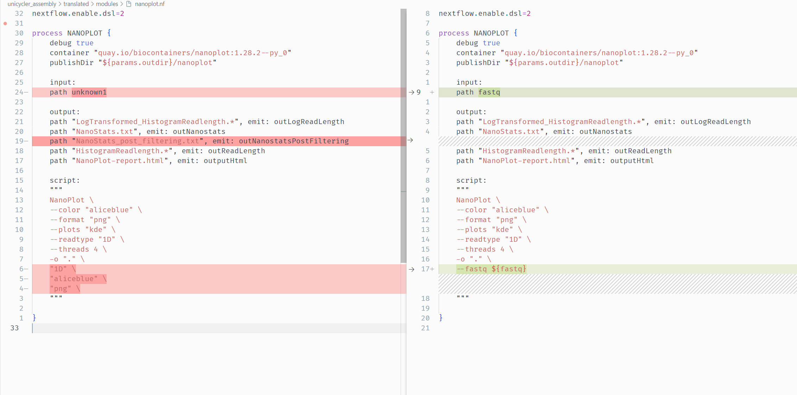

## Janis Translation

To translate a workflow,  we use `janis translate`.

For a Galaxy workflow we specify the .ga file:

```
janis translate --from galaxy --to nextflow ./source/unicycler_assembly.ga
```

The `--from` specifies the source workflow language, and `--to` specifies the destination. 

For a CWL / WDL workflow we instead supply the workflow folder:

```
janis translate --from cwl --to nextflow my_workflow/
```

The output translation will contain multiple files and directories.

```
translated
├── main.nf                 # main workflow
├── modules                 # folder containing nextflow processes
│   ├── busco.nf    
│   ├── fastqc.nf
│   ├── nanoplot.nf
│   ├── quast.nf
│   └── unicycler.nf
├── nextflow.config         # config file to supply input information
├── subworkflows            # folder containing nextflow workflows
└── templates               # folder containing any scripts used by processes
```

<br>

## Setup Inputs

To start bebugging the translated workflow, change into the translation directory
```
cd translated
```

The first thing to do is set up inputs. 
We provide inputs in the nextflow.config file as params. 

```
nextflow.enable.dsl=2
docker.enabled = true

params {
    
    // Macro for optional types
    // (do not alter unless you know what you are doing)
    NULL = 'NULL'

    // WORKFLOW OUTPUT DIRECTORY
    outdir  = './outputs'

    // INPUTS (MANDATORY)
    in_long      = NULL  // (MANDATORY generic file)  
    in_short_r1  = NULL  // (MANDATORY generic file)  
    in_short_r2  = NULL  // (MANDATORY generic file)  

    // INPUTS (OPTIONAL)
    fastqc1_adapters         = NULL  // (optional generic file)  
    fastqc1_contaminants     = NULL  // (optional generic file)  
    fastqc1_limits           = NULL  // (optional generic file)  
    fastqc2_adapters         = NULL  // (optional generic file)  
    fastqc2_contaminants     = NULL  // (optional generic file)  
    fastqc2_limits           = NULL  // (optional generic file)  
    unicycler_contamination  = NULL  // (optional generic file)  
    unicycler_start_genes    = NULL  // (optional generic file)  


}
```

NULL 

INPUTS (MANDATORY)

INPUTS (OPTIONAL)

PROCESS 1 

SUBWORKFLOW 1


<br>

## Run Workflow

Before running the workflow, have a look through the files to locate any issues you see.  <br>
Once you are satisfied, try to run the workflow. 


To run the workflow, first ensure that docker is running. <br>
The translation can then be run using the following:
```
nextflow run main.nf
```

This will almost certainly cause nextflow errors as the translation is unlikely to be perfect. 

Without making any changes, nextflow produces the following error message:

```
Caused by:
  Process `NANOPLOT (1)` terminated with an error exit status (2)

Command executed:

  NanoPlot     --color "aliceblue"     --format "png"     --plots "kde"     --readtype "1D"     --threads 4     -o "."     "1D"     "aliceblue"     "png"

NanoPlot: error: one of the arguments --fastq --fasta --fastq_rich --fastq_minimal --summary --bam --ubam --cram --pickle is required
```

To fix this, we will look at the NanoPlot manpage and the nextflow process for this tool. 

<br>

## First Error

Our first error is triggered when nextflow runs the NANOPLOT task. 

NanoPlot is a tool used in the workflow, so its translation will appear as a nextflow ***process*** in the `modules` directory as `nanoplot.nf`. 

```
nextflow.enable.dsl=2

process NANOPLOT {
    debug true
    container "quay.io/biocontainers/nanoplot:1.28.2--py_0"
    publishDir "${params.outdir}/nanoplot"

    input:
    path unknown1

    output:
    path "LogTransformed_HistogramReadlength.*", emit: outLogReadLength
    path "NanoStats.txt", emit: outNanostats
    path "NanoStats_post_filtering.txt", emit: outNanostatsPostFiltering
    path "HistogramReadlength.*", emit: outReadLength
    path "NanoPlot-report.html", emit: outputHtml

    script:
    """
    NanoPlot \
    --color "aliceblue" \
    --format "png" \
    --plots "kde" \
    --readtype "1D" \
    --threads 4 \
    -o "." \
    "1D" \
    "aliceblue" \
    "png" \
    """

}
```


Some Galaxy tools are notoriously complex, and therefore hard for `janis translate`.<br>
There are a number of visible errors in this file. We will address them one-by-one.<br>

The manual for NanoPlot can be found [here](https://github.com/wdecoster/NanoPlot#usage).

<br>

**Issue 1 - Uninformative Input Name**

```
input:
path unknown1
```

Janis has correctly detected there is a single input needed for this process.<br> 
It has also detected that this input is a file, so has declared it as a `path` input. <br>
That said, the name isn't helpful. 

**Fixing This Issue**

To fix this issue, lets give it a more appropriate name. <br>
This workflow uses NanoPlot to perform QC on our input nanopore reads. <br>
We will change its name to ***reads*** as this provides clarity. 

```
input:
path reads
```

<br>

> **Why does this occur?**
> 
> The name for this path process input is `unknown1`.  <br>
> Inputs named `unknown*` commonly occur for Galaxy tool translations. <br>
> This occurs when a *galaxy* tool input doesn't map 1-to-1 to an actual *software* input.
> 
> In this case:
> - The Galaxy tool wrapper has an input called **'files'** which is what this `unknown1` represents. <br>
> - The Galaxy tool wrapper also has an input called **'Type of the file(s) to work on'** which is the format of input files. 
> - The Galaxy tool wrapper then dynamically creates a NanoPlot command based on the above.
> 
> For example - if we supply the following:
> - ***Type of the file(s) to work on:*** fastq
> - ***files:*** reads.fq
> 
> The string `--fastq reads.fq` is injected into the NanoPlot command. 
> 
> Another example:
> - ***Type of the file(s) to work on:*** bam
> - ***files:*** alignments.bam
> 
> The string `--bam alignments.bam` is injected into the NanoPlot command. 
> 
> <br>
> 
> The Galaxy tool input **'files'** can therefore be associated with any of the following NanoPlot arguments:
> ```
> --fastq --fasta --fastq_rich --fastq_minimal --summary --bam --ubam --cram --pickle
> ```
> We label these inputs as **unknown*** as we do not know which software argument the Galaxy tool input wires to!

<br>

**Issue 2 - Missing Argument**

According to the NanoPlot docs [here](https://github.com/wdecoster/NanoPlot#usage), NanoPlot requires one of the following:
```
--fastq --fasta --fastq_rich --fastq_minimal --summary --bam --ubam --cram --pickle
```

**Fixing This Issue**

In this workflow, NanoPlot is being used to perform read QC for our nanopore reads. <br>
The reads are *fastq* files, so lets add the following to the ***script*** section:
```
script:
"""
NanoPlot \
--fastq ${reads} \     <<<
--color "aliceblue" \
...
"""
```

This binds the `--fastq` argument to whatever arrives as the `reads` process input. 

<br>

**Issue 2 - Malformed Command**

Some NanoPlot arguments have been included twice in the translation. <br>
This is an error with `janis translate` and is due to complexity of Galaxy tool wrappers. 

```
script:
"""
...
--color "aliceblue" \   <<<
--format "png" \        <<<
--plots "kde" \
--readtype "1D" \       <<<
"1D" \                  <<<
"aliceblue" \           <<<
"png" \                 <<<
"""
```

**Fixing This Issue**

To fix this issue, we simply delete the repeated arguments. 

<br>

**Rerun The Workflow**


Now that NanoPlot has been tidied up, we can rerun the workflow. 
We will use the same command to run the nextflow workflow each time. 
```
nextflow run main.nf
```

All changes made to this file can be seen in the diff below:



<br>

**Side Note: Viewing Galaxy Tool Wrappers?**

TODO: include the galaxy wrappers in a source folder? 

<br>

## Second Error


